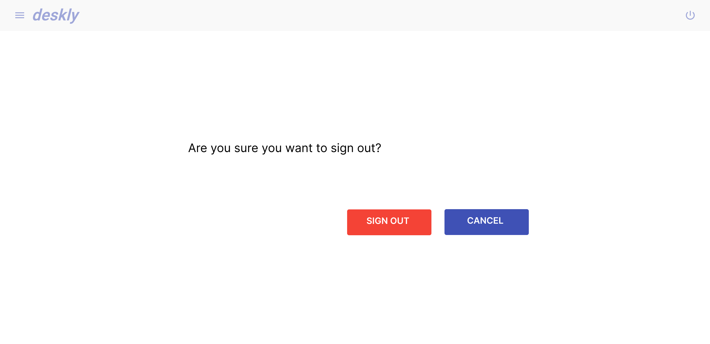
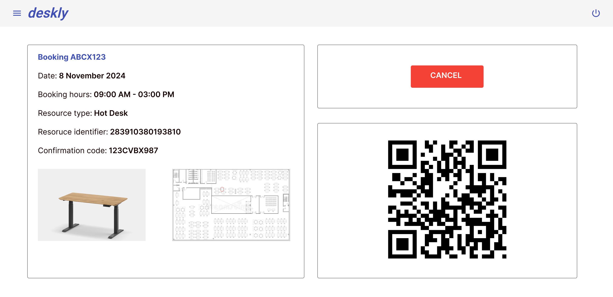
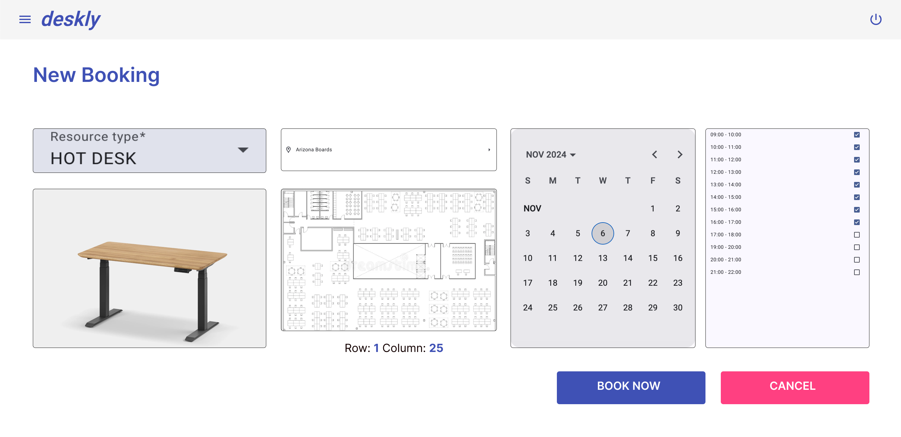
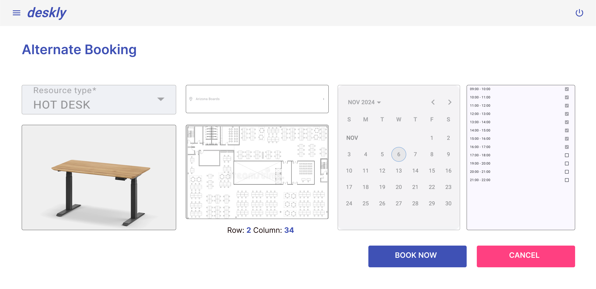
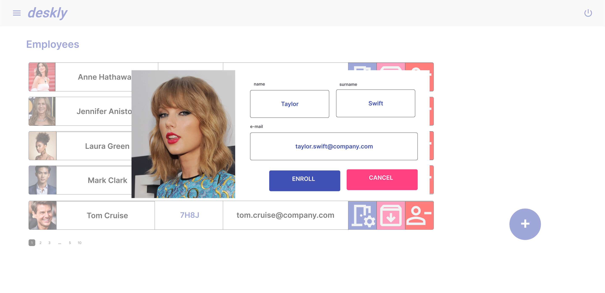
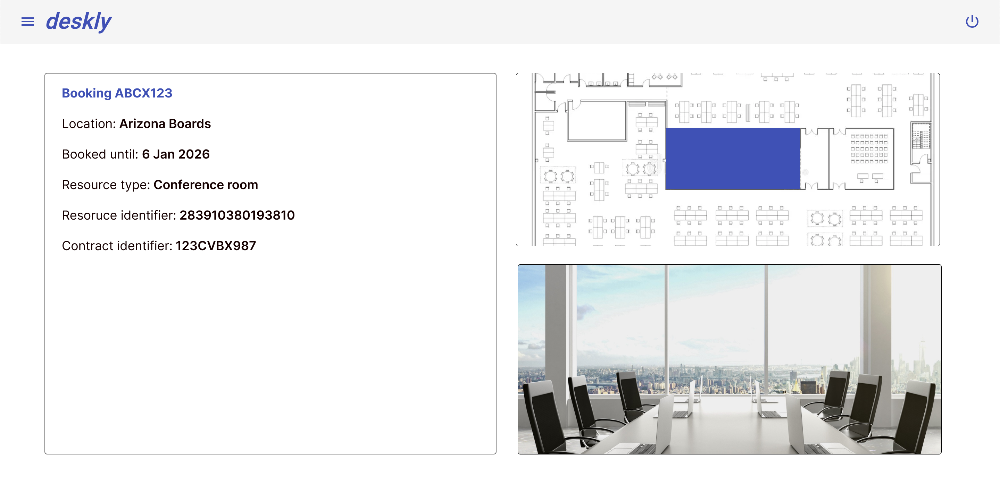

# Wyniki etapu I - Modelowanie biznesowe i specyfikacja wymagań

## Model biznesowy

### Lista symboli, oznaczeń i akronimów
- SaaS - software as a service

### Cel i zakres projektu

Celem projektu jest stworzenie systemu wspomagającego prowadzenie współdzielonych przestrzeni roboczych (ang. coworking area), oraz rezerwację dostępnych w nich zasobów sprzętowych oraz pomieszczeń biurowych. 
Zakres projektu obejmuje:
- Zarządzanie przestrzeniami biurowymi pod kątem inwentaryzacji zasobów, ich dostępnością, a także kosztami rezerwacji
- Usprawninie procesu rezerwacji zasobów biurowych
- Obsługa zawierania umów długoterminowego wynajmu zasobów i przestrzeni biurowych

### Strategia biznesowa

Końcowy produkt będzie dystrybuowany w modelu SaaS. Docelowi klienci to firmy prowadzące lub chcące rozpocząć działalność coworkingową.

### Słownik pojęć

| Termin | Definicja terminu |
|--------|-------------------|
| Klient „z ulicy” | Klient, który nie chce wiązać się umowami. Osoba fizyczna. Wykorzystanie zasoby naliczane jest po aktualnym cenniku. Potrzebuje dostępu od zaraz na to co jest aktualnie dostępne bez gwarancji dostępności |
| Klient stały | Klient, który ma podpisaną umowę z gwarancją cen na zasoby na rok. Osoba fizyczna. Wykorzystanie zasobów naliczane jest po cenniku zawartym w umowie. Potrzebuje dostępu od zaraz na to co jest aktualnie dostępne bez gwarancji dostępności |
| Klient biznesowy | Firma, która ma podpisaną umowę z gwarancją na zasoby i ceny na 12 miesięcy. Klient, który wie jakie zasoby dokładnie potrzebuje i na jaką długość czasu |
| Potencjalny klient | Każda osoba lub firma, która chce rozpocząć korzystanie z przestrzeni coworking |
| Booking Manager | Pracownik Deskly odpowiadający za ciągłość w rezerwacji zasobów. Śledzi wykorzystanie zasobów. Jego rolą jest optymalizacja rezerwacji w celu maksymalizacji zysków i rozwiązywanie problemów związanych z rezerwacjami. Prowadzi negocjacje z klientami biznesowymi i akceptuje lub odrzuca umowy. Może zarządzać jedną lub wieloma lokacjami. |
| Location Manager	| Pracownik Deskly odpowiadający za stan zasobów oferowanych w jednej lub wielu lokacjach. Zleca kupno i konserwację zasobów. Negocjuje i podpisuje umowy z właścicielami nowych lokacji |
| Contract Manager | Pracownik Deskly odpowiedzialny za pozyskiwanie nowych klientów. Przygotowuje wersje robocze umów oraz prowadzi negacjacje warunków umów. Podejmuje ostateczną decyzję o podpisaniu umowy z klientem. |
| Cennik | Zbiór cen wypozyczenia zasobów na daną jednostkę czasu (godzina, doba, miesiąc). Moze byc to cennik biezacy lub zdefinionwany w ramach umowy |	
| Topologia | Układ pomieszczeń i biurek w lokacji |
| Zasób | Sprzęt biurowy lub miejsce pracy (biurko lub sala konferencyjna) |
| Lokacja | Miejsce, w którym mozna korzystać z zarezerwowanych zasobów Deskly |
| Kolejka | Uporządkowana grupa osób oczekująca na mozliwość zarezerwowania zasobu |
| Umowa | Porozumienie pomiędzy Deskly, a klientem. Definiuje koszty korzystania z zasobów.  |	

## Specyfikacja i analiza wymagań

## Definicja wymagań funkcjonalnych

1. Klient Deskly (wspólne)
    1. Jako klient Deskly chciałbym mieć możliwość zalogować się do/wylogować się ze swojego konta użytkownika.
    2. Jako klient Deskly chciałbym mieć podgląd kodu QR do otwarcia drzwi z poziomu konta użytkownika.
2. Klient Deskly "z ulicy" i stały
    1. Jako klient Deskly po rezerwacji zasobu chciałbym otrzymać kod QR na maila umożliwiający otwarcie drzwi wejściowych do danej lokacji 24 godziny przed rozpoczęciem rezerwacji.
    2. Jako klient Deskly chciałbym mieć podgląd wszystkich wynajętych zasobów oraz szczegółów każdej z aktywnych rezerwacji.
    3. Jako klient Deskly chciałbym mieć możliwość rezerwacji zasobu w dowolnie wybranej lokacji.
    4. Jako klient Deskly chciałbym podczas rezerwacji biurka lub sali konferencyjnej być w stanie wybrać interesujący mnie zasób korzystając ze schematu topologii lokacji.
    5. Jako klient Deskly chciałbym zapisać się na listę oczekujących na zasób w danym terminie (jeśli jest już zarezerwowany przez kogoś innego), gdy czas do rozpoczęcia rezerwacji jest dłuższy niż 24 godziny.
    6. Jako klient Deskly chciałbym móc wypisać się z kolejki oczekujących na dany zasób w dowolnym momencie.
    7. Jako klient Deskly oczekujący w kolejce na zasób chciałbym zostać poinformowany o rozwiązaniu kolejki i otrzymać propozycję rezerwacji/zakolejkowania się na tożsamy zasób.
3. Klient stały
    1. Jako klient stały chciałbym zostać poinformowany mailowo o zbliżającym się końcu umowy.
    2. Jako klient stały chciałbym otrzymać propozycję automatycznego przedłużenia umowy wraz ze szczegółami o aktualnym cenniku. 
4. Klient Deskly Biznesowy
    1. Jako klient biznesowy Deskly chciałbym mieć podgląd wszystkich wynajętych zasobów oraz szczegółów każdej z aktywnych rezerwacji.
    2. Jako klient biznesowy Deskly chciałbym, żeby po akceptacji umowy przez Contract Managera wynegocjowane zasoby zostały zarezerwowane w imieniu firmy z datą rozpoczęcia umowy dla wskazanych pracowników firmy i żeby dla tych pracowników zostały automatycznie wygenerowane konta użytkownika z dostępem do zasobów.
    3. Jako klient biznesowy Deskly chciałbym posiadać konto użytkownika, które będzie pozwalać mi jako pracodawcy zarządzać dostępem do zarezerwowanych zasobów dla pracowników. 
    4. Jako klient biznesowy Deskly chciałbym móc stworzyć konto nowemu pracownikowi i nadać mu uprawnienia do korzystania z zarezerwowanych zasobów.
5. Location Manager
    1. Jako Location Manager chciałbym móc dodać lokację i zdefiniować zasoby w danej lokacji (rodzaj zasobu, zdjęcia, dane seryjne (w przyadku biurek oraz sprzętu audio-wideo), liczba miejsc (w przypadku sali konferencyjnej), opis).
    2. Jako Location Manager mogę zlecić konserwację zasobu.
    3. Jako Location Manager mogę zlecić automatyczną konserwację dla konkretnego typu zasobu (np. po każdym wynajęciu sali 30 minut na sprzątanie)
    4. Jako Location Manager mogę wyłączyć dany zasób z użytkowania (nawet jeśli jest aktualnie zarezerwowany).
    5. Jako Location Manager chciałbym zdefiniować godziny otwarcia danej lokacji.
    6. Jako Location Manager chciałbym móc zdefiniować topologię zasobów w danej lokacji (dodać/usunąć/modyfikować)
    7. Jako Location Manager chiałbym mieć możliwość aktualizacji danych lokalizacji oraz dostępnych zasobów.
6. Contract Manager
    1. Jako Contract Manager chciałbym mieć możliwość wysłania do edycji wersji roboczej umowy do wcześniej zweryfikowanego klienta.
    2. Jako Contract Manager chciałbym mieć możliwość akceptacji oraz proponowania zmian w umowie udostępnionej klientowi.
    3. Jako Contract Manager chciałbym mieć możliwość akceptacji oraz odrzucenia umowy z potencjalnym klientem.     
7. Finance Manager
    1. Jako Finance Manager chciałbym mieć podgląd do klientów, którzy nie uregulowali faktury na czas.
    2. Jako Finance Manager chciałbym wysłać fakturę do klienta zgodną z rzeczywistym wykorzystaniem przez niego zasobów w danym okresie rozliczeniowym.
    3. Jako Finance Manager chciałbym mieć podgląd do wszystkich wystawionych faktur.
    4. Jako Finance Manager chciałbym mieć podgląd do cenników, według których naliczane są opłaty w danej lokacji dla danych klientów.
    5. Jako Finance Manager chciałbym mieć wgląd do wszystkich zawartych umów.
8. Booking Manager
    1. Jako Booking Manager chciałbym przesuwać dowolnych klientów w kolejce na oczekiwany zasób.
    2. Jako Booking Manager chciałbym mieć podgląd do obłożenia rezerwacjami w danej lokacji (ile aktualnie jest zarezerwowanych zasobów przez kogo i na jak długo).
    3. Jako Booking Manager chciałbym mieć możliwość przeniesienia rezerwacji klienta na tożsamy zasób.
    4. Jako Booking Manager chciałbym mieć możliwość dodania/usunięcia z puli zasobów klienta biznesowego.
    5. Jako Booking Manager mogę rozwiązać kolejkę oczekującą na zasób.
9. Potencjalny Klient
    1. Jako potencjalny klient Deskly chciałbym mieć możliwość stworzenia konta użytkownika.
    2. Jako potencjalny klient Deskly chciałbym mieć możliwość akceptacji umowy/proponowania zmian w umowie/odrzucenia umowy.

## Definicja wymagań niefunkcjonalnych

###	Wymagania systemowe
1. System działa na urządzeniach z systemem operacyjnym Linux (Ubuntu od wersji 20.04 LTS), MacOS (od wersji 15.0), Windows (Windows 10, Windows 11) oraz przeglądarkach internetowych (Chrome, Frirefox, Safari, Edge)
2. System działa na urządzeniach mobilnych z systemem operacyjnym Android(od wersji 11.0) oraz iOS (od wersji 15.0)
3. System powinien obsługiwać bazę danych o wysokiej wydajności, wspierającą relację pomiędzy obiektami (PostgreSQL, Oracle, MSSQL, MySQL)
4. Wszystkie usługi powinny działać w chmurze AWS i wspierać mechanizmy auto-skalowania
5. System powinien integrować się z zewnętrznymi dostawcami poczty elektorniczne oraz systemami kontroli dostępu (generowanie kodów QR)

###	Wydajność
1. System powinien być w stanie obsłużyć jednoczesne logowanie i rezerwacje dokonywane przez co najmniej 10.000 użytkowników (1000 zapytań na sekundę przy założeniu że użytkownik wykonuje zapytanie średnio co 10 sekund) 
2. Czas odpowiedzi na operacje związane z rezerwacjami i dostpem od zasobów nie powinien przekraczać 2 sekund
3. Czas wyszukiwania zasobów oraz generowania raporów finansowych powinen trwać poniżej 3 sekund

###	Prawo
1. System powinien spełniać regulację GDPR (General Data Protection Regulation) w zakresie przetwarzania, przechowywania i usuwania danych osobowych użytkowników
2. Mysi istnieć możliwość prowadzenia logów audytowych dla wszystkich danych związanych z negocjacją umowy oraz danych związanych z rezerwacjami

### Bezpieczeństwo
1. Dane osobowe i dane związane z rezerwacjami powinny być szyfrowane w bazie danych oraz podczas przesyłania (TLS)

### Dostępność
1. System powinie mieć dostępność na poziomie minimum 99,9%
2. W przypadku awarii, system powinien być w stanie przywrócić dostępność w ciągu maksymalnie 1h
3. Dopuszczalna jest spójność ostateczna na replikach baz danych w przypadkach takich jak:
    1.  Informacje o dostępnych zasobach
    2.  Podgląd szczegółów rezerwacji
    3.  Zarządzanie kolejkami oczekujączych na zasoby
    4.  Informacje o cennikach
    5.  Powiedomienia o zbliżających się końcach umów

### Skalowalność
- System powinien automatycznie skalować się w górę lub w dół w zależności od liczby aktywnych użytkowników oraz zapotrzebowania na zasoby
- Skalowanie horyzontalne owinno umożliwiwać dodawania nowych instancji w przypadku dużego obciążenia i równomiernie dystrybułować do nich ruch
- Architektura wdrożeniowa systemu poiwnn być podzielona na mikroserwisy umożliwiając niezależne skalowanie krytycznych usług (np. obsługa rezerwacji, wysyłanie kodów QR, rozliczenia)

### Wsparcie
- System powinien mieć wdrożony proces wsparcia technicznego dla klientów z możliwiwością zgłoszeń przez aplikację
- Zautomatyzowane monitorowanie wydajności i dostępności aplikacji oraz natychmiastowe powiadomienia dla zespołu wsparcia w przypadku wykrycia anomalii

## Model informacyjny (Mapa kontekstów)

## Reguły biznesowe i ograniczenia systemowe

- Klienci którzy nie uregulowali opłaty po 7 dniach od wystawienia faktury, tracą dostęp do zasobów Deskly i rozpoczyna się naliczanie odsetek od niezapłaconej faktury.
- Klient otrzymuje przypomnienie o opłaceniu faktury, 3 dni po dacie jej wystawienia.
- Klient (stały lub "z ulicy"), który zarezerwuje zasób nie może anulować rezerwacji, jeśli do rozpoczęcia rezerwacji pozostało mniej niż 24 godziny. W przeciwnym przypadku anulowanie rezerwacji jest mozliwe.
- Klienci "z ulicy" i klienci "stali" mogą mieć maksymalnie 5 aktywnych rezerwacji jednocześnie.
- Klienci biznesowi nie mogą rezerwować innych zasobów i kolejkować się na inne zasoby niż te które zostały do im przypisane w wyniku negocjacji umowy.
- Kolejka do danego zasobu trwa do momentu, gdy potencjalny rezerwujący (ostatni w kolejce który otrzymał możliwość rezerwacji) nie zaakceptuje oferty rezerwacji.
- Kolejka do zarezerwoanego zasobu zostaje rozwiązana jezeli akceptacja rezerwacji następuje mniej niz 24 godziny przed planowaną datą rezerwacji.
- Pracownicy klienta biznesowego Deskly nie muszą rezerwować zasobów, aby z nich skorzystać.
- Pracownicy klienta biznesowego Deskly nie mogą korzystać z innych zasobów, niz wynegocjowane przez firmę.
- Kod QR umozliwiający wejście do lokacji umozliwia wejście do sali konferencyjnej jezeli jest ona przedmiotem rezerwacji lub umowy.

## Prototypy interfejsów użytkownika

### Jako klient Deskly chciałbym mieć możliwość zalogować się do/wylogować się ze swojego konta użytkownika.

Mapa nawigacyjna

Strona domowa

Strona logowania

Ekran domowy (szablon)

### Jako potencjalny klient Deskly chciałbym mieć możliwość stworzenia konta użytkownika.

Mapa nawigacyjna

Panel rejestracji

### Jako klient Deskly po rezerwacji zasobu chciałbym otrzymać na maila kod QR umożliwiający otwarcie drzwi wejściowych do danej lokacji 24 godziny przed rozpoczęciem rezerwacji.

Przykład wiadomości e-mail

### Jako klient stały chciałbym zostać poinformowany mailowo o zbliżającym się końcu umowy.
### Jako klient stały chciałbym otrzymać propozycję automatycznego przedłużenia umowy wraz ze szczegółami o aktualnym cenniku.

Mapa nawigacyjna

Przykład wiadomości e-mail

Ekran przedłuzenia umowy

### Jako klient Deskly chciałbym mieć podgląd wszystkich wynajętych zasobów oraz szczegółów każdej z aktywnych rezerwacji.
### Jako klient Deskly chciałbym mieć podgląd kodu QR do otwarcia drzwi z poziomu konta użytkownika.

Mapa nawigacyjna

Lista rezerwacji

Podgląd rezerwacji

### Jako klient Deskly chciałbym mieć możliwość rezerwacji zasobu w dowolnie wybranej lokacji.
### Jako klient Deskly chciałbym podczas rezerwacji biurka lub sali konferencyjnej być w stanie wybrać interesujący mnie zasób korzystając ze schematu topologii lokacji.
### Jako klient Deskly chciałbym zapisać się na listę oczekujących na zasób w danym terminie (jeśli jest już zarezerwowany przez kogoś innego), gdy czas do rozpoczęcia rezerwacji jest dłuży niż 24 godziny.

Mapa nawigacyjna

Strona rezerwacji

Modal kolejkowania się

### Jako klient Deskly chciałbym móc wypisać się z kolejki oczekujących na dany zasób w dowolnym momencie.

Mapa nawigacyjna

Kolejki na zasoby

Podgląd zakolejkowanego zasobu

### Jako klient Deskly oczekujący w kolejce na zasób chciałbym zostać poinformowany o rozwiązaniu kolejki i otrzymać propozycję rezerwacji/zakolejkowania się na tożsamy zasób.

Mapa nawigacyjna

Przykład wiadomości e-mail

Alternatywa rezerwacja

### Jako Location Manager chciałbym móc dodać lokację i zdefiniować zasoby w danej lokacji (rodzaj zasobu, zdjęcia, dane seryjne (w przyadku biurek oraz sprzętu audio-wideo), liczba miejsc (w przypadku sali konferencyjnej), opis).
### Jako Location Manager chciałbym zdefiniować godziny otwarcia danej lokacji.

### Jako Location Manager mogę zlecić konserwację zasobu.
### Jako Location Manager mogę zlecić automatyczną konserwację dla konkretnego typu zasobu (np. po każdym wynajęciu sali 30 minut na sprzątanie)
### Jako Location Manager mogę wyłączyć dany zasób z użytkowania (nawet jeśli jest aktualnie zarezerwowany).

### Jako Location Manager chciałbym móc zdefiniować topologię zasobów w danej lokacji (dodać/usunąć/modyfikować)
### Jako Location Manager chiałbym mieć mozliwosc aktualizacacji danych lokalizacji oraz dostępnych zasobów.

### Mapa nawigacyjna - Location Manager

### Jako Contract Manager chciałbym mieć możliwość wysłania do edycji wersji roboczej umowy do wcześniej zweryfikowanego klienta.
### Jako Contract Manager chciałbym mieć możliwość akceptacji oraz proponowania zmian w umowie udostępnionej klientowi.
### Jako Contract Manager chciałbym mieć możliwość akceptacji oraz odrzucenia umowy z potencjalnym klientem.

### Mapa nawigacyjna - Contract Manager

### Jako Finance Manager chciałbym mieć podgląd do klientów, którzy nie uregulowali faktury na czas.
### Jako Finance Manager chciałbym wysłać fakturę do klienta zgodną z rzeczywistym wykorzystaniem przez niego zasobów w danym okresie rozliczeniowym.

### Jako Finance Manager chciałbym mieć podgląd do wszystkich wystawionych faktur.

### Jako Finance Manager chciałbym mieć podgląd do cenników, według których naliczane są opłaty w danej lokacji dla danych klientów.

### Jako Finance Manager chciałbym mieć wgląd do wszystkich zawartych umów.

### Mapa nawigacyjna - FinanceManager

### Jako Booking Manager chciałbym przesuwać dowolnych klientów w kolejce na oczekiwany zasób.

### Jako Booking Manager chciałbym mieć podgląd do obłożenia rezerwacjami w danej lokacji (ile aktualnie jest zarezerwowanych zasobów przez kogo i na jak długo).

### Jako Booking Manager chciałbym mieć możliwość przeniesienia rezerwacji klienta na tożsamy zasób.
### Jako Booking Manager chciałbym mieć możliwość dodania/usunięcia z puli zasobów klienta biznesowego.

### Jako Booking Manager mogę rozwiązać kolejkę oczekującą na zasób.

### Mapa nawigacyjna - Booking Manager

### Jako klient biznesowy Deskly chciałbym móc stworzyć konto nowemu pracownikowi i nadać mu uprawnienia do korzystania z zarezerwowanych zasobów.

Mapa nawigacyjna

Wszyscy pracownicy

Nowy pracownik

### Jako klient biznesowy Deskly chciałbym posiadać konto użytkownika, które będzie pozwalać mi jako pracodawcy zarządzać dostępem do zarezerwowanych zasobów dla pracowników.
### Jako klient biznesowy Deskly chciałbym mieć podgląd wszystkich wynajętych zasobów oraz szczegółów każdej z aktywnych rezerwacji.

Mapa nawigacyjna

Zarezerwowane zasoby

Zarezerwowany zasób

