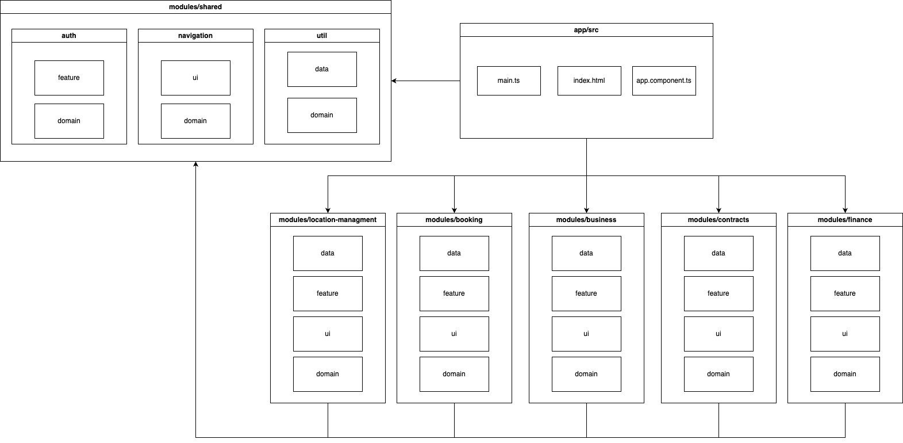
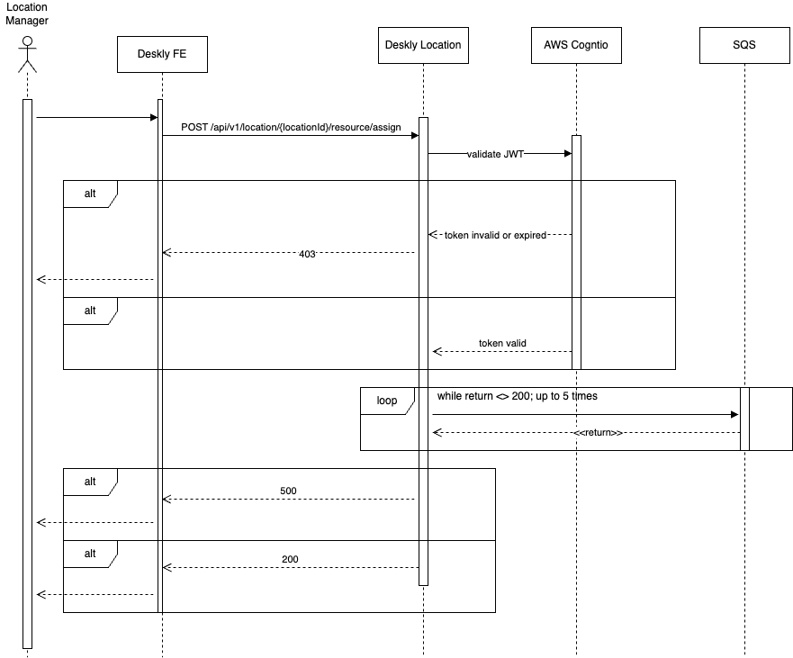

# Wyniki etapu II - Decyzja architektury systemu

- Kamil Bońkowski, 252727
- Szymon Walasik, 283393
- Jakub Wierzchowiec, 252738

## Cel

Dokument przedstawia decyzje i ich uzasadnienie oraz ograniczenia i ważne elementy projektu systemu rozwiązania, które wpływają na jego implementację.

## Cele i ograniczenia architektoniczen

## Mechanizmy architektoniczne

## Widoki architekotniczne

### Widok kontekstowy (C4 Context)


### Scenariusze interakcji (C4 Container)


### Interfejsy integracyjne

|Aspekt|Opis|
|--------|-----------|
|Aplikacja źródłowa|Deskly FE|
|Aplikacja docelowa|Deskly Location|
|Techinika integracji||
|Mechanizm uwierzytelniania||
|Manipulacja na danych wrazliwych?||
|Strona inicujująca||
|Model komunikacji||
|Wydajność||
|Wolumetria||
|Wymagana dostępność||

## Widok funkcyjny (C4 Component)


## Widok rozmieszczenia (Architekrura Wdrożeniowa)


## Widok informacyjny

### Model informacyjny

- Deskly Core


- Deskly Location


### Projekt Bazy Danych

## Widok wytwarzania 

### Frontend

Aplikacja frontendowa zostanie zaimplementowana we frameworku Angular 19. Do zbudowania aplikacji zostanie wykorzystane zostanie narzędzie nx. Aplikacja została podzielona na moduły reprezentujące domeny grupujące funkcjonalności udostępniane uzytkownikom koncowym. Centralnym punktem aplikacji będzie katalog `src` zawierający pliki `index.html` (definiuje wstępną struktruę DOM) oraz  `main.ts` (od tego pliku rozpoczyna sie ładowanie logiki aplikacji). Kazdy z modułów ma zblizoną strukturę obejmującę 1 - 4 katalogów ze zbioru (`feature` - komponenty smart, `ui` - komponenty prezentacyjne, `data` - serwisy biznesowe, zarządzanie stanem, komunikacja z backendem oraz `domain` - modele danych). Moduły są leniwie ładowane, co umozliwia optymalizację wczytywania aplikacji, poprzez ładowanie jedynie tych fragmentów aplikacji, które są potrzebne danemu uzytkownikowi. Ponizej zamieszczono diagram prezentujący widok wytwarzania aplikacji frontendowej.



### Backend

## Realizacja przypadku użycia (Przypisanie zasobu do lokacji)

Przypisanie zasobu jest inicjowane przez Location Managera z poziomu klienta Deskly. Polega na przesłaniu zapytania POST zawierającego identyfikatory przypisywanych zasobów.

Przykład zapytania
```
curl --location 'localhost:8080/api/v1/location/6f0a36c6-6814-4e38-b40b-0a65b2f7c3c6/resource/assign' \
--header 'Content-Type: application/json' \
--data '{
    "resourceIds": ["db37fe1a-ab0e-4f9d-8b43-5bf84dcc3648", "7f446172-971e-48c1-b5bc-0538b96dfc20"]
}'
```

Diagram sekwencji


