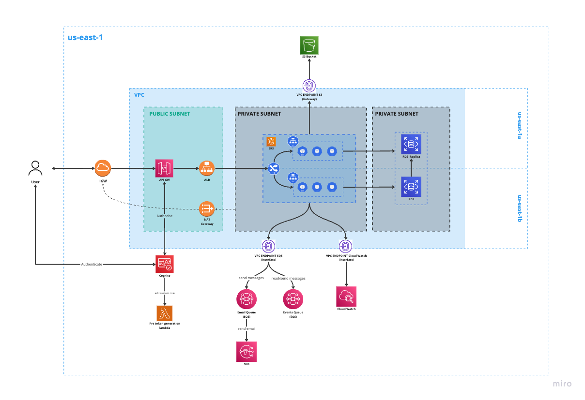

# Wyniki etapu II - Decyzja architektury systemu

- Kamil Bońkowski (252727)
- Szymon Walasik (283393)
- Jakub Wierzchowiec (252738)

## Cel

Dokument przedstawia decyzje i ich uzasadnienie oraz ograniczenia i ważne elementy projektu systemu rozwiązania, które
wpływają na jego implementację.

## Cele architektoniczne

- System będzie udostępniać funkcjonalność rezerwacji zasobów biurowych.
- System będzie umożliwiać zarządzanie zasobami biurowymi w zakresie możliwości ich rezerwacji oraz inwentaryzacji.
- System będzie umożliwiać zawieranie umów najmu zasobów oraz korzystania z zasobów będących przedmiotem ww. umów.
- System umożliwi kontakt z klientami za pośrednictwem wiadomości e-mail.
- Oczekiwana dostępność systemu to 99,9% czasu jego działania.
- System powinien być w stanie obsłużyć zmienną liczbę użytkowników w ciągu doby, sięgającą 10000 jednoczesnych
  użytkowników w godzinach szczytu.
- Architektura systemu umożliwi łatwe skalowanie i rozszerzanie rozwiązania.
- Użytkownicy końcowi będą wchodzić w interakcję z systemem za pośrednictwem intuicyjnych i responsywnych interfejsów
  użytkownika.

## Ograniczenia architektoniczne

- System musi działać w oparciu o rozwiązania chmurowe dostarczone przez AWS.
- Wersja MVP powinna powstać w ciągu 12 miesięcy.
- Aplikacja frontendowa musi zostać zaimplementowana we frameworku Angular, z wykorzystaniem języka TypeScript.
- Aplikacje backendowe muszą zostać zaimplementowane we frameworku Spring Boot, z wykorzystaniem języka Java.
- Warstwa backendowa systemu powstanie w architekturze mikroserwisowej.
- Średni czas odpowiedzi dla mikroserwisów nie może przekraczać 10s.
- System musi zapewniać bezpieczeństwo danych poufnych oraz zgodność z przepisami RODO.

## Decyzje i ich uzasadnienia

### Architektura aplikacyjna

| <div style="width:500px">Uzasadnienie</div>                                                                    | <div style="width:400px">Model</div>                           |
|----------------------------------------------------------------------------------------------------------------|----------------------------------------------------------------|
| Ułatwienie testowania i zapewnienie wysokiej jakości w modelach typu Core Domain                               | [`D/01` Architektura heksagonalna](#architektura-heksagonalna) |
| Niski koszt implementacji dla problemów klasy CRUD                                                             | [`D/02` Architektura warstwowa](#architektura-warstwowa)       |
| Zapewnienie audytowalnych zmian stanu rezerwacji `NFR/LEG/02`                                                  | [`D/03` Event Sourcing](#event-sourcing)                       |
| Zapewnienie mechanizmów concurrency control dla problemów klasy Konkurencja o zasoby                           | [`D/04` Optimistic Locking](#architektura-mikroserwisowa)      |
| Zapewnienie spójności logiki biznesowej w problemach klasy Konkurencja o zasoby                                | [`D/05` Wzorzec Agregat](#wzorzec-agregat)                     |
| Uproszczenie komunikacji pomiędzy modelami dostarczając stabilny interfejs do komunikacji dla każdego z modeli | [`D/06` Wzorzec Fasady](#wzorzec-fasady)                       |
| Zapewnienie lepszej organizacji pracy zespołów oraz ułatwienia zarządzania złożonością                         | [`D/07` Struktury Dużej Skali](#struktury-dużej-skali)         |

### Architektura wdrożeniowa

| <div style="width:600px">Drivery Architektoniczne</div>                            | <div style="width:500px">Decyzja</div>                                                                                   |
|------------------------------------------------------------------------------------|--------------------------------------------------------------------------------------------------------------------------|
| `NFR/PER/01`, `NFR/AVA/01`, `NFR/SCL/01`, `NFR/SCL/03`                             | [`D/08` Architektura mikroserwisowa](#architektura-mikroserwisowa)                                                       |
| `NFR/PER/01`, `NFR/PER/02`, `NFR/PER/03`, `NFR/SCL/02`                             | [`D/09` Load Balancing](#load-balancing)                                                                                 |
| `NFR/PER/01`, `NFR/SCL/03`                                                         | [`D/10` Amazon Simple Queue Service](#amazon-simple-queue-service)                                                       |
| `NFR/PER/01`, `NFR/PER/02`, `NFR/AVA/01`                                           | [`D/11` Wzorzec API Gateway](#wzorzec-api-gateway)                                                                       |
| `NFR/PER/02`, `NFR/LEG/01`                                                         | [`D/12` Sieć wewnętrzna VPC](#sieć-wewnętrzna-vpc)                                                                       |
| `NFR/PER/02`, `NFR/SCL/01`, `NFR/SCL/03`                                           | [`D/13` Oddzielne bazy danych dla mikroserwisów](#oddzielne-bazy-danych-dla-mikroserwisów)                               |
| `NFR/LEG/01`, `NFR/SEC/01`                                                         | [`D/14` Amazon S3 Bucket](#amazon-s3-bucket)                                                                             |
| `NFR/SEC/01`                                                                       | [`D/15` Nat Gateway](#nat-gateway)                                                                                       |
| `FR/KD/01`, `FR/PK/01`                                                             | [`D/16` Amazon Lambda](#amazon-lambda)                                                                                   |
| `NFR/SEC/01`                                                                       | [`D/17` Internet Gateway](#internet-gateway)                                                                             |
| `FR/KD/01`, `FR/PK/01`                                                             | [`D/18` Autoryzacja z wykorzystaniem JWT](#autoryzacja-z-wykorzystaniem-jwt)                                             |
| `NFR/PER/02`, `NFR/SEC/01`, `NFR/AVA/01`, `NFR/AVA/02`                             | [`D/19` Wdrożenie w chmurze AWS](#wdrożenie-w-chmurze-aws)                                                               |
| `NFR/PER/02`, `NFR/SEC/01`, `NFR/AVA/01`, `NFR/AVA/02`, `NFR/SCL/01`, `NFR/SCL/03` | [`D/20` Kubernetes (EKS) jako platforma od zarządzania kontenerami](./ADR/adr-014-containers-orchiestration-platform.md) |
| `FR/KD/01`, `FR/KD/14`, `FR/KD/15`, `FR/PK/01`                                     | [`D/21` Wykorzystanie AWS Cognito do uwierzytelniania i autoryzacji](./ADR/adr-015-authentication-and-authorization.md)  |
| `NFR/SYS/03`, `NFR/PER/02`, `NFR/SCL/03`                                           | [`D/22` Silnik bazodanowy PostgreSQL](./ADR/adr-012-database.md)                                                         |
| `NFR/SYS/03`, `NFR/PER/02`, `NFR/LEG/01`, `NFR/SEC/01`, `NFR/AVA/03`, `NFR/SCL/03` | [`D/23` Relacyjna baza danych Amazon RDS](#relacyjna-baza-danych-amazon-rds)                                             |
| `FR/KD/03`, `FR/KD/09`, `FR/KD/10`                                                 | [`D/24` AWS Simple Notification Service](#amazon-simple-notification-service)                                            |

### Modele domenowe

| <div style="width:700px">Drivery architektoniczne</div>                            | <div style="width:400px">Model</div>                                             |
|------------------------------------------------------------------------------------|----------------------------------------------------------------------------------|
| `FR/KD/06`, `FR/LM/01`, `FR/LM/04`, `FR/LM/05`, `FR/LM/06`, `FR/LM/07`, `FR/LM/08` | [`D/25` Location](./ADR/adr-002-model-location.md)                               |
| `FR/KD/13`, `FR/LM/02`, `FR/LM/03`, `FR/BM/03`, `FR/BM/04`                         | [`D/26` Availability](./ADR/adr-003-model-availability.md)                       |
| `FR/KD/02`, `FR/KD/14`, `FR/KD/15`                                                 | [`D/27` Resource Access Control](./ADR/adr-004-model-resource-access-control.md) |
| `FR/KD/04`, `FR/KD/05`, `FR/KD/12`, `FR/KD/13`, `FR/LM/02`, `FR/BM/02`             | [`D/28` Reservation](./ADR/adr-005-model-reservation.md)                         |
| `FR/LM/01`                                                                         | [`D/29` Pricing](./ADR/adr-006-model-pricing.md)                                 |
| `FR/CM/01`, `FR/CM/02`, `FR/CM/03`, `FR/PK/02`                                     | [`D/30` Contract Negotiation](./ADR/adr-007-model-contract-negotiation.md)       |
| `FR/CM/01`                                                                         | [`D/31` Documents](./ADR/adr-008-model-documents.md)                             |
| `FR/FM/01`, `FR/FM/02`, `FR/FM/03`, `FR/FM/04`, `FR/FM/05`                         | [`D/32` Financials](./ADR/adr-009-model-financials.md)                           |
| `FR/KD/01`, `FR/KD/13`                                                             | [`D/33` System Access Control](./ADR/adr-010-model-system-access-control.md)     |
| `FR/KD/07`, `FR/KD/08`, `FR/KD/09`, `FR/BM/01`, `FR/BM/05`                         | [`D/34` Waitlist](./ADR/adr-011-model-waitlist.md)                               |

## Mechanizmy Architektoniczne

### Infrastrukturalne

### Wdrożenie w chmurze AWS

Zagadnienie: Wybór infrastruktury wdrożeniowej stanowi strategiczne wyzwanie, które wpływa na późniejszą wydajność i
elastyczność systemu. Kluczowe są tutaj takie kwestie, jak skalowalność, optymalizacja kosztów oraz zdolność do
adaptacji wobec zmieniających się wymagań biznesowych. Tradycyjna infrastruktura lokalna (on-premise) często ogranicza
możliwości szybkiej reakcji na te zmiany, co rodzi potrzebę poszukiwania bardziej elastycznych rozwiązań, takich jak
infrastruktura chmurowa.

Rozwiązanie: W ramach projektu postanowiono wykorzystać chmurę Amazon Web Services (AWS) jako podstawową platformę
wdrożeniową. Decyzja ta opierała się na analizie kluczowych wymagań projektu, takich jak szybka dostępność zasobów,
globalny zasięg, a także wiele usług umożliwiających zaawansowaną personalizację infrastruktury.
AWS pozwala na elastyczne zarządzanie zasobami w oparciu o model „pay-as-you-go”. Dzięki temu unika się kosztów
związanych z nadmiarową infrastrukturą, co jest szczególnie istotne w projektach, które charakteryzują się dużymi
wahaniami obciążenia. Ponadto, AWS oferuje zaawansowane funkcje zabezpieczeń oraz dostępność na poziomie globalnym.

Różnice między podejściami wdrożeniowymi:

- Infrastruktura lokalna (on-premise):
  Wybór infrastruktury lokalnej zapewnia pełną kontrolę nad danymi i fizycznym sprzętem, co bywa kluczowe w przypadku
  organizacji o szczególnych wymogach bezpieczeństwa. Jednak wdrożenie tego modelu wiąże się z wysokimi kosztami
  początkowymi, koniecznością zatrudnienia wykwalifikowanego zespołu IT oraz ograniczeniami w elastyczności skalowania.

- Chmura publiczna (AWS):
  Z kolei infrastruktura oparta na chmurze publicznej umożliwia dynamiczne skalowanie w zależności od potrzeb, co
  pozwala na optymalizację kosztów i zasobów. AWS daje także dostęp do globalnej sieci centrów danych, co minimalizuje
  opóźnienia i zwiększa komfort użytkowników końcowych. Chmura publiczna eliminuje również konieczność zakupu sprzętu
  oraz ponoszenia kosztów jego utrzymania.

#### Porównanie dostawców chmurowych

| **Dostawca**                | **Zalety**                                                                                                                                                                                                      | **Wady**                                                                                                                                                                |
|-----------------------------|-----------------------------------------------------------------------------------------------------------------------------------------------------------------------------------------------------------------|-------------------------------------------------------------------------------------------------------------------------------------------------------------------------|
| `Amazon Web Services (AWS)` | - Największy wybór usług<br>- Globalna sieć centrów danych<br>- Dojrzały ekosystem i renoma<br>- Wysoka niezawodność i bezpieczeństwo<br>- Elastyczne ceny w modelu „pay-as-you-go”                             | - Brak pełnego wsparcia dla hybrydowych rozwiązań<br>- Kompleksowość może utrudnić początkową konfigurację                                                              |
| `Microsoft Azure`           | - Doskonała integracja z ekosystemem Microsoft (np. Active Directory, Office 365)<br>- Wsparcie dla hybrydowej infrastruktury<br>- Szerokie możliwości PaaS<br>- Popularność w środowiskach korporacyjnych      | - Mniejszy wybór usług w porównaniu z AWS<br>- Mniejsza liczba globalnych centrów danych<br>- Koszty licencji Microsoft mogą zwiększać wydatki                          |
| `Google Cloud (GCP)`        | - Lider w zakresie big data i uczenia maszynowego (BigQuery, TensorFlow)<br>- 100% infrastruktury zasilanej odnawialną energią<br>- Najlepsze wsparcie dla Kubernetes<br>- Wysoka jakość narzędzi analitycznych | - Mniejszy zasięg globalny niż AWS i Azure<br>- Skupienie na big data, co może ograniczać przydatność w innych środowiskach<br>- Mniej popularny na rynku korporacyjnym |

Kluczowe cechy AWS:
AWS oferuje setki usług, takich jak przechowywanie danych (Amazon S3), maszyny wirtualne (EC2), systemy bazodanowe (RDS)
oraz narzędzia do analizy danych. Dodatkowo, platforma wyróżnia się:

- Globalnym zasięgiem: AWS posiada centra danych w wielu regionach świata, co zapewnia niskie opóźnienia i wysoką
  niezawodność.
- Elastycznością: Użytkownicy mogą łatwo dostosowywać zasoby do zmieniających się wymagań.
- Bezpieczeństwem: Zaawansowane mechanizmy szyfrowania oraz certyfikaty zgodności z międzynarodowymi standardami (np.
  ISO 27001).
- Innowacyjnością: AWS regularnie wprowadza nowe usługi wspierające innowacyjne technologie, takie jak uczenie maszynowe
  czy Internet Rzeczy (IoT).

**Decyzja:** Wybór AWS jako infrastruktury wdrożeniowej wynikał z potrzeby elastyczności, niezawodności oraz globalnego
wsparcia.
Dzięki różnorodności oferowanych usług i możliwości szybkiego skalowania, AWS okazał się optymalnym rozwiązaniem dla
tego projektu.

### Load Balancing

**Zagadnienie:** W systemach rozproszonych lub aplikacjach obsługujących dużą liczbę użytkowników kluczowym wyzwaniem
jest
równomierne rozdzielanie ruchu sieciowego. Brak odpowiedniego mechanizmu prowadzi do przeciążenia jednych serwerów,
podczas gdy inne pozostają niewykorzystane. Przeciążone serwery mogą skutkować opóźnieniami, błędami aplikacji lub
całkowitą niedostępnością usług.

**Rozwiązanie:** Load Balancing (równoważenie obciążenia) to technika dystrybucji ruchu sieciowego pomiędzy wiele
serwerów w
celu zapewnienia optymalnego wykorzystania zasobów, minimalizacji opóźnień oraz zapewnienia wysokiej dostępności
aplikacji. Mechanizm ten może być wdrażany na różnych poziomach, takich jak warstwa aplikacyjna, sieciowa lub
infrastrukturalna.

#### Zalety i wady różnych rozwiązań Load Balancing

| **Rodzaj**                   | **Zalety**                                                                                                                                                         | **Wady**                                                                                                                     |
|------------------------------|--------------------------------------------------------------------------------------------------------------------------------------------------------------------|------------------------------------------------------------------------------------------------------------------------------|
| **Sprzętowy Load Balancer**  | - Bardzo wysoka wydajność<br>- Dedykowane urządzenia z wyspecjalizowanym oprogramowaniem<br>- Dobre wsparcie dla dużych sieci korporacyjnych                       | - Wysoki koszt zakupu i utrzymania<br>- Trudności z elastycznym skalowaniem<br>- Zależność od dostawcy sprzętu               |
| **Programowy Load Balancer** | - Możliwość wdrożenia na serwerach w chmurze lub lokalnych<br>- Wysoka elastyczność i integracja z narzędziami DevOps<br>- Niższe koszty niż rozwiązania sprzętowe | - Może nie osiągać wydajności sprzętowych rozwiązań<br>- Wymaga odpowiedniej konfiguracji i optymalizacji                    |
| **Load Balancing w chmurze** | - Automatyczne skalowanie i łatwość konfiguracji<br>- Integracja z innymi usługami chmurowymi<br>- Rozliczenie w modelu pay-as-you-go                              | - Zależność od dostawcy chmury<br>- Opóźnienia związane z komunikacją między regionami<br>- Koszty mogą rosnąć wraz z ruchem |

Mechanizm Load Balancingu dostępny w wybranej chmurze - AWS Elastic Load Balancing (ELB):

- AWS oferuje kilka rodzajów Load Balancerów, takich jak Application Load Balancer (ALB), Network Load Balancer (NLB)
  oraz Gateway Load Balancer (GLB). Dzięki temu możliwe jest dostosowanie rozwiązania do specyficznych wymagań
  aplikacji (np. warstwa aplikacji, TCP/UDP).
- Zalety: Automatyczna integracja z EC2, wysokie bezpieczeństwo, globalna dostępność.
- Wady: Koszty mogą być wysokie w przypadku dużego ruchu.

### Amazon Simple Queue Service

**Zagadnienie:** W aplikacjach rozproszonych oraz mikroserwisowych, często pojawia się konieczność niezawodnego i
skalowalnego przesyłania wiadomości między komponentami. Bez odpowiednich mechanizmów, ryzyko utraty danych,
przeciążenia systemu czy trudności w zarządzaniu kolejnością i priorytetem wiadomości znacząco rośnie.

**Rozwiązanie:** Amazon Simple Queue Service (SQS) to w pełni zarządzana usługa kolejkowania wiadomości, która umożliwia
aplikacjom rozproszonym komunikację w sposób asynchroniczny. Dzięki temu różne komponenty systemu mogą działać
niezależnie, skalować się w różnym tempie i przetwarzać dane w odpowiednim momencie, co zwiększa elastyczność i
odporność całej infrastruktury.

Rodzaje kolejek w SQS

1. Standard Queue

- Zapewnia wysoką przepustowość przesyłania wiadomości.
- Gwarantuje co najmniej jednokrotne dostarczenie wiadomości, ale ich kolejność nie jest gwarantowana.
- Idealne do aplikacji, w których kolejność wiadomości nie jest kluczowa.

2. FIFO Queue (First-In-First-Out)

- Zapewnia kolejność wiadomości zgodnie z ich wysyłaniem.
- Gwarantuje dokładnie jednokrotne dostarczenie wiadomości.
- Odpowiednie dla aplikacji wymagających ścisłej kontroli kolejności.

#### Zalety Amazon Simple Queue Service (SQS)

| **Zaleta**                          | **Opis**                                                                                           |
|-------------------------------------|----------------------------------------------------------------------------------------------------|
| **Brak zarządzania infrastrukturą** | SQS jest w pełni zarządzaną usługą, co eliminuje konieczność obsługi serwerów.                     |
| **Skalowalność**                    | Automatycznie skaluje się, aby obsłużyć dowolną ilość wiadomości i obciążenie systemu.             |
| **Bezpieczeństwo**                  | Integracja z AWS IAM umożliwia kontrolę dostępu do kolejek.                                        |
| **Elastyczność**                    | Obsługuje zarówno kolejki Standard, jak i FIFO, co pozwala dostosować się do potrzeb aplikacji.    |
| **Niezawodność**                    | Dane są przechowywane na wielu serwerach w centrach danych AWS, co minimalizuje ryzyko ich utraty. |
| **Integracja**                      | Działa bezproblemowo z innymi usługami AWS, np. Lambda, EC2 czy SNS.                               |

#### Wady Amazon Simple Queue Service (SQS)

| **Wada**                                 | **Opis**                                                                                           |
|------------------------------------------|----------------------------------------------------------------------------------------------------|
| **Koszty**                               | W przypadku dużej liczby operacji koszty mogą rosnąć.                                              |
| **Opóźnienia w dostarczaniu wiadomości** | W przypadku kolejek Standard, wiadomości mogą być dostarczone więcej niż raz i w innej kolejności. |
| **Limit długości wiadomości**            | Maksymalny rozmiar wiadomości wynosi 256 KB, co może wymagać podziału dużych danych.               |

**Decyzja:** W projekcie Amazon SQS został wybrany jako rozwiązanie do zarządzania asynchroniczną komunikacją między
mikroserwisami. Usługa ta zapewnia skalowalność, niezawodność oraz integrację z innymi komponentami AWS, co ułatwia
rozwój i utrzymanie systemu.

### Amazon Simple Notification Service

AWS SNS to w pełni zarządzana usługa publikowania/subskrybowania (pub/sub), która pozwala na wysyłanie powiadomień do
aplikacji, urządzeń oraz użytkowników. Jest często wykorzystywana w aplikacjach rozproszonych do efektywnej wymiany
wiadomości pomiędzy różnymi systemami i usługami.

**Kluczowe cechy**:

- **Model publikowania/subskrybowania (pub/sub):** umożliwia jednoczesne wysyłanie wiadomości do wielu subskrybentów.
- **Wielokanałowość:** obsługuje różne kanały komunikacji, takie jak e-maile, SMS-y, powiadomienia push i HTTP/HTTPS.
- **Elastyczność:** możliwość integracji z wieloma innymi usługami AWS, np. Lambda, SQS.
- **Wysoka dostępność:** działa w modelu wysokiej dostępności, co zapewnia niezawodność przesyłania wiadomości.
- **Skalowalność:** automatycznie dostosowuje się do zmiennego obciążenia.
- **Bezpieczeństwo:** obsługuje mechanizmy uwierzytelniania i autoryzacji przy użyciu IAM.
- **Monitorowanie:** integracja z Amazon CloudWatch umożliwia monitorowanie wydajności i stanu usługi.

### Zalety

| Zalety                               | Opis                                                               |
|--------------------------------------|--------------------------------------------------------------------|
| **Szybkość i niezawodność**          | Zapewnia szybkie dostarczanie wiadomości do subskrybentów.         |
| **Łatwość integracji**               | Integracja z wieloma usługami AWS, jak Lambda czy SQS.             |
| **Wielokanałowość**                  | Obsługuje różnorodne kanały komunikacji, w tym SMS, e-mail i HTTP. |
| **Wysoka dostępność i skalowalność** | Automatyczne skalowanie w zależności od obciążenia.                |
| **Monitorowanie i bezpieczeństwo**   | Obsługa CloudWatch i mechanizmów IAM dla bezpieczeństwa.           |

### Wady

| Wady                              | Opis                                                                |
|-----------------------------------|---------------------------------------------------------------------|
| **Brak mechanizmu kolejkowania**  | Nie przechowuje wiadomości, jeśli subskrybent nie jest dostępny.    |
| **Ograniczenia kosztowe**         | Może generować wysokie koszty przy dużej liczbie wiadomości.        |
| **Złożoność konfiguracji**        | Może wymagać wiedzy o innych usługach AWS do efektywnej integracji. |
| **Ograniczenia w personalizacji** | Personalizacja wiadomości (np. e-maili) jest ograniczona.           |

**Decyzja:** AWS SNS zostanie wykorzystany w systemie ze względu na możliwość obsługi dużej liczby e-maili w krótkim
czasie, prostą integrację z innymi usługami AWS, gwarancję szybkiego dostarczania powiadomień oraz wysoką dostępność
usługi, co minimalizuje ryzyko utraty wiadomości.

### Architektura mikroserwisowa

**Zagadnienie:** W miarę jak aplikacje rosną, stają się coraz bardziej złożone i trudne do zarządzania. Monolityczne
podejście, w którym cały system jest jednym, dużym komponentem, staje się coraz mniej efektywne, gdy chodzi o rozwój,
skalowanie czy utrzymanie. Zwiększa się ryzyko awarii, trudności w zarządzaniu zespołami deweloperskimi, a także
problematyczna staje się elastyczność w implementacji nowych funkcji.

Rozwiązanie: Architektura mikroserwisowa to podejście, w którym aplikacja jest rozdzielona na szereg niezależnych,
małych serwisów, które komunikują się ze sobą za pomocą interfejsów API. Każdy mikroserwis odpowiada za konkretną
funkcjonalność i może być rozwijany, wdrażany oraz skalowany niezależnie od innych. W ramach tej architektury zespół
deweloperski może skoncentrować się na mniejszych częściach aplikacji, co przyspiesza rozwój i zwiększa niezawodność
systemu.

**Kluczowe cechy:**

- Rozdzielenie funkcji: Każdy mikroserwis realizuje jeden, dobrze zdefiniowany aspekt biznesowy lub techniczny
  aplikacji.
- Autonomiczność: Mikroserwisy są niezależne w zakresie wdrożeń, testów i skalowania.
- Komunikacja między serwisami: Mikroserwisy komunikują się za pomocą API, często przy użyciu REST lub gRPC.
- Niezależność technologiczna: Każdy mikroserwis może być napisany w innej technologii, języku programowania czy bazie
  danych.
- Skalowalność: Możliwość skalowania każdego mikroserwisu niezależnie w odpowiedzi na zmieniające się potrzeby.
- Zarządzanie awariami: W przypadku awarii jednego mikroserwisu reszta systemu nie musi przestawać działać.

#### Zalety architektury mikroserwisowej

| **Zaleta**                                  | **Opis**                                                                                                  |
|---------------------------------------------|-----------------------------------------------------------------------------------------------------------|
| **Skalowalność**                            | Możliwość skalowania poszczególnych serwisów w zależności od ich obciążenia.                              |
| **Niezależność wdrożeń**                    | Każdy mikroserwis może być rozwijany i wdrażany niezależnie od innych.                                    |
| **Elastyczność technologiczna**             | Każdy mikroserwis może być oparty na innym stosie technologicznym.                                        |
| **Zwiększona niezawodność**                 | Awaria jednego mikroserwisu nie powoduje awarii całego systemu.                                           |
| **Szybszy rozwój i czas reakcji na zmiany** | Zespoły mogą pracować nad różnymi mikroserwisami równolegle, co skraca czas implementacji nowych funkcji. |

#### Wady architektury mikroserwisowej

| **Wada**                                       | **Opis**                                                                                                    |
|------------------------------------------------|-------------------------------------------------------------------------------------------------------------|
| **Złożoność zarządzania**                      | Większa liczba usług może prowadzić do trudności w monitorowaniu i zarządzaniu całą infrastrukturą.         |
| **Kompleksowość komunikacji między serwisami** | Konieczność zarządzania i monitorowania komunikacji oraz zapewnienia niezawodności API.                     |
| **Wydajność**                                  | Możliwość opóźnień wynikających z komunikacji między mikroserwisami, zwłaszcza przy dużej liczbie serwisów. |
| **Zarządzanie danymi**                         | Rozproszone bazy danych mogą prowadzić do trudności w synchronizacji i zarządzaniu stanem aplikacji.        |
| **Dodatkowe wymagania na infrastrukturę**      | Większe wymagania dotyczące infrastruktury, np. zarządzanie kontenerami, orkiestracja (np. Kubernetes).     |

**Decyzja:** Architektura mikroserwisowa została wybrana w projekcie, aby zapewnić elastyczność w rozwoju i zarządzaniu
aplikacją, a także umożliwić skalowanie jej poszczególnych elementów. Dzięki rozdzieleniu odpowiedzialności na mniejsze,
niezależne serwisy, aplikacja jest bardziej odporna na awarie i łatwiejsza w rozwoju.

### Wzorzec API Gateway

Zagadnienie: W dużych systemach rozproszonych, szczególnie w architekturze mikroserwisowej, zarządzanie komunikacją
między wieloma serwisami może stać się trudne. Każdy mikroserwis może mieć różne interfejsy API, co prowadzi do
złożoności w obsłudze połączeń, uwierzytelniania, monitorowania i zarządzania ruchem. Brak centralnego punktu kontroli w
systemie powoduje konieczność replikowania tych funkcji w każdym mikroserwisie, co jest nieefektywne.

Rozwiązanie: Wzorzec API Gateway to podejście, w którym cała komunikacja między klientami a mikroserwisami przechodzi
przez jeden centralny punkt, który pełni funkcje proxy. API Gateway odpowiada za przekazywanie zapytań do odpowiednich
serwisów, zarządzanie bezpieczeństwem, logowaniem, monitorowaniem oraz transformacją danych. Może także oferować
mechanizmy cache'owania, load balancing czy throttlingu.

**Kluczowe cechy:**

- Centralizacja komunikacji: Wszystkie zapytania przychodzące do systemu są kierowane do API Gateway, który następnie
  rozdziela je do odpowiednich mikroserwisów.
- Ujednolicone API: Klient komunikuje się z jednym API, a nie z wieloma mikroserwisami.
- Bezpieczeństwo: API Gateway może przejąć odpowiedzialność za uwierzytelnianie i autoryzację, np. za pomocą tokenów
  JWT.
- Monitorowanie i logowanie: API Gateway może agregować dane o ruchu w systemie, zapewniając centralne logowanie i
  monitorowanie.
- Load balancing: Może pełnić funkcję load balancera, rozdzielając obciążenie między różne instancje mikroserwisów.
- Modyfikacja danych: API Gateway może również transformować dane przed ich wysłaniem do mikroserwisów lub przed
  przekazaniem odpowiedzi do klienta.

#### Zalety wzorca API Gateway

| **Zaleta**                           | **Opis**                                                                                    |
|--------------------------------------|---------------------------------------------------------------------------------------------|
| **Centralizacja zarządzania**        | API Gateway centralizuje komunikację i kontrolę nad ruchem do wszystkich mikroserwisów.     |
| **Redukcja złożoności dla klientów** | Klient łączy się z jednym API zamiast z wieloma mikroserwisami, co upraszcza interfejs.     |
| **Bezpieczeństwo**                   | Ujednolicenie mechanizmów uwierzytelniania i autoryzacji w jednym miejscu (np. OAuth, JWT). |
| **Łatwiejsze monitorowanie**         | Łatwiejsze zbieranie logów, metryk i monitorowanie ruchu w jednym miejscu.                  |
| **Optymalizacja wydajności**         | API Gateway może implementować cache'owanie, co zmniejsza liczbę zapytań do mikroserwisów.  |

#### Wady wzorca API Gateway

| **Wada**                    | **Opis**                                                                                                                       |
|-----------------------------|--------------------------------------------------------------------------------------------------------------------------------|
| **Pojedynczy punkt awarii** | Jeśli API Gateway ulegnie awarii, może to sparaliżować całą komunikację z mikroserwisami.                                      |
| **Wąskie gardło**           | Może stanowić wąskie gardło, jeśli nie jest odpowiednio skalowany, szczególnie przy dużym ruchu.                               |
| **Złożoność zarządzania**   | Dodanie warstwy API Gateway może zwiększyć złożoność infrastruktury, wymagając dodatkowego zarządzania.                        |
| **Opóźnienia**              | Może wprowadzać dodatkowe opóźnienie w komunikacji, zwłaszcza gdy wykonuje dodatkowe operacje, takie jak transformacja danych. |

**Decyzja:** W projekcie zdecydowano się na zastosowanie wzorca API Gateway, aby uprościć komunikację między klientami a
mikroserwisami, zapewniając centralne zarządzanie ruchem, bezpieczeństwem oraz monitorowaniem. Dzięki temu możliwe jest
łatwiejsze zarządzanie całą aplikacją oraz zapewnienie jej elastyczności i skalowalności.

### Sieć wewnętrzna VPC

Zagadnienie: W tradycyjnych infrastrukturach IT, sieć wewnętrzna jest zarządzana w obrębie firmy, gdzie wszystkie
urządzenia są połączone w obrębie jednej sieci lokalnej (LAN). W przypadku rozwiązań chmurowych, gdzie zasoby są
rozproszone geograficznie i mogą być zarządzane przez różne podmioty, zarządzanie siecią wewnętrzną staje się wyzwaniem.
Wymaga to zapewnienia bezpiecznej, izolowanej sieci, która pozwala na komunikację między usługami w chmurze, zapewniając
jednocześnie ochronę przed nieautoryzowanym dostępem z zewnątrz.

Rozwiązanie: VPC (Virtual Private Cloud) to rozwiązanie oferowane przez dostawców chmurowych, które pozwala na tworzenie
prywatnych sieci w chmurze. VPC umożliwia pełną kontrolę nad tym, jak są połączone zasoby w chmurze, jakie mają adresy
IP, jakie usługi są dostępne, oraz jak wygląda komunikacja z innymi sieciami (np. z Internetem). VPC zapewnia izolację
od innych klientów chmury oraz możliwość konfiguracji zaawansowanych mechanizmów zabezpieczeń, takich jak firewalle,
subnets, czy VPN.

**Kluczowe cechy:**

- Izolacja i prywatność: Użytkownicy mogą tworzyć izolowane sieci, które są oddzielone od innych klientów chmury.
- Kontrola nad konfiguracją: Umożliwia dokładną konfigurację podsieci, routingu, bramek internetowych, połączeń VPN i
  innych elementów sieciowych.
- Skalowalność: VPC może być łatwo skalowane w miarę wzrostu potrzeb organizacji.
- Bezpieczeństwo: Wbudowane mechanizmy kontroli dostępu (ACL, security groups) pozwalają na zarządzanie dostępem do
  zasobów w VPC.
- Integracja z innymi usługami chmurowymi: VPC umożliwia łatwą integrację z innymi usługami chmurowymi, takimi jak bazy
  danych, load balancers, czy usługi obliczeniowe.

#### Zalety VPC

| **Zaleta**                                  | **Opis**                                                                                                     |
|---------------------------------------------|--------------------------------------------------------------------------------------------------------------|
| **Izolacja i prywatność**                   | VPC zapewnia pełną izolację zasobów, co umożliwia większe bezpieczeństwo aplikacji i danych.                 |
| **Skalowalność**                            | Możliwość łatwego skalowania zasobów w chmurze, dostosowując je do zmieniających się potrzeb organizacji.    |
| **Zaawansowane zarządzanie ruchem**         | Pełna kontrola nad ruchem przychodzącym i wychodzącym, w tym konfiguracja subnets, route tables, VPN.        |
| **Integracja z innymi usługami chmurowymi** | Łatwa integracja z szeroką gamą usług chmurowych, co umożliwia elastyczność i adaptację infrastruktury.      |
| **Bezpieczeństwo**                          | Mechanizmy takie jak firewalle, security groups oraz ACL zapewniają kontrolę nad dostępem i ochronę zasobów. |

#### Wady VPC

| **Wada**                                   | **Opis**                                                                                                                |
|--------------------------------------------|-------------------------------------------------------------------------------------------------------------------------|
| **Złożoność konfiguracji**                 | Konfiguracja VPC, podsieci, routingu i polityk zabezpieczeń może być skomplikowana, szczególnie w dużych systemach.     |
| **Potrzebna wiedza specjalistyczna**       | Aby poprawnie zaprojektować i zarządzać VPC, potrzebna jest znajomość sieci i zasad chmurowych usług.                   |
| **Ograniczenia wydajności**                | W przypadku niewłaściwej konfiguracji VPC mogą wystąpić problemy z wydajnością, np. z opóźnieniami w komunikacji.       |
| **Potrzebna infrastruktura do integracji** | Integracja z innymi sieciami lub systemami on-premise może wymagać dodatkowej infrastruktury (np. VPN, Direct Connect). |

**Decyzja:** W projekcie zdecydowano się na wdrożenie VPC, aby zapewnić pełną kontrolę nad siecią wewnętrzną, zwiększyć
bezpieczeństwo zasobów w chmurze oraz umożliwić łatwą integrację z innymi usługami chmurowymi. Dzięki tej architekturze
możliwe było uzyskanie pełnej izolacji sieci oraz precyzyjnej konfiguracji polityk dostępu.

### Oddzielne bazy danych dla mikroserwisów

**Zagadnienie:** W tradycyjnych monolitycznych aplikacjach często stosuje się jedną wspólną bazę danych dla całej
aplikacji.
W architekturze mikroserwisowej, gdzie każdy mikroserwis jest niezależnym bytem, współdzielenie jednej bazy danych może
prowadzić do silnych zależności między serwisami, co utrudnia ich niezależny rozwój i skalowanie. Dodatkowo, różne
mikroserwisy mogą mieć różne wymagania dotyczące przechowywania danych, co sprawia, że jedna wspólna baza danych nie
zawsze jest optymalnym rozwiązaniem.

**Rozwiązanie:** Każdy mikroserwis powinien posiadać własną, dedykowaną bazę danych. Takie podejście zapewnia pełną
autonomię mikroserwisów, umożliwiając im niezależny rozwój, skalowanie oraz wybór najbardziej odpowiedniego typu bazy
danych dla swoich potrzeb. Dodatkowo, izolacja danych między mikroserwisami zwiększa bezpieczeństwo i ułatwia
zarządzanie danymi.

**Kluczowe cechy:**

- Autonomia mikroserwisów: Każdy mikroserwis zarządza swoimi danymi, co pozwala na niezależny rozwój i wdrażanie.
- Izolacja danych: Brak współdzielenia bazy danych między mikroserwisami zwiększa bezpieczeństwo i ułatwia zarządzanie
  danymi.
- Optymalny dobór technologii: Możliwość wyboru najbardziej odpowiedniego typu bazy danych (SQL, NoSQL) dla konkretnego
  mikroserwisu.
- Skalowalność: Niezależne bazy danych pozwalają na skalowanie poszczególnych mikroserwisów zgodnie z ich wymaganiami.

#### Zalety

| **Zaleta**                      | **Opis**                                                                                               |
|---------------------------------|--------------------------------------------------------------------------------------------------------|
| **Niezależność mikroserwisów**  | Każdy mikroserwis może być rozwijany, wdrażany i skalowany niezależnie od innych.                      |
| **Izolacja danych**             | Brak współdzielenia bazy danych zwiększa bezpieczeństwo i ułatwia zarządzanie danymi.                  |
| **Optymalny dobór technologii** | Możliwość wyboru najbardziej odpowiedniego typu bazy danych (SQL, NoSQL) dla konkretnego mikroserwisu. |
| **Skalowalność**                | Niezależne bazy danych pozwalają na skalowanie poszczególnych mikroserwisów zgodnie z ich wymaganiami. |

#### Wady

| **Wada**                            | **Opis**                                                                                                            |
|-------------------------------------|---------------------------------------------------------------------------------------------------------------------|
| **Złożoność zarządzania danymi**    | Rozproszenie danych może prowadzić do trudności w zarządzaniu spójnością i integracją danych między mikroserwisami. |
| **Brak transakcji rozproszonych**   | Brak wspólnej bazy danych uniemożliwia stosowanie tradycyjnych transakcji ACID między mikroserwisami.               |
| **Potrzebna synchronizacja danych** | Wymaga implementacji mechanizmów synchronizacji i spójności danych między mikroserwisami.                           |

**Decyzja:** W projekcie zdecydowano się na implementację oddzielnych baz danych dla każdego mikroserwisu, aby zapewnić
pełną autonomię, bezpieczeństwo oraz optymalny dobór technologii dla poszczególnych komponentów systemu.

### Amazon S3 Bucket

Zagadnienie: Amazon S3 (Simple Storage Service) to usługa przechowywania obiektów, która pozwala na łatwe przechowywanie
i odzyskiwanie dowolnych ilości danych z dowolnego miejsca w Internecie. Problem pojawia się, gdy aplikacje potrzebują
przechowywać duże pliki, takie jak obrazy, filmy, pliki tekstowe czy pliki dzienników w sposób bezpieczny, skalowalny i
dostępny z wielu różnych lokalizacji. Rozwiązaniem jest użycie usługi S3 w celu zarządzania przechowywaniem danych w
sposób bardziej elastyczny i wydajny.

**Rozwiązanie:** Amazon S3 Bucket pozwala na tworzenie "wiader" (buckets), w których przechowywane są dane. Dzięki
wysokiej
dostępności, skalowalności, bezpieczeństwu i integracji z innymi usługami AWS, S3 stało się podstawowym rozwiązaniem do
przechowywania danych w chmurze. Zaletą jest również możliwość ustawiania polityk dostępu, integracja z AWS Lambda oraz
łatwa integracja z systemami zewnętrznymi.

**Kluczowe cechy:**

- Skalowalność: Amazon S3 jest wysoce skalowalne i może pomieścić dowolną ilość danych.
- Bezpieczeństwo: S3 zapewnia zaawansowane mechanizmy ochrony danych, takie jak szyfrowanie oraz kontrola dostępu.
- Dostępność: S3 zapewnia wyjątkową dostępność danych dzięki rozproszeniu danych w wielu centrach danych.
- Integracja: S3 dobrze współpracuje z innymi usługami AWS, takimi jak Lambda, CloudFront, Glacier.

#### Zalety

| **Zaleta**               | **Opis**                                                                                                        |
|--------------------------|-----------------------------------------------------------------------------------------------------------------|
| **Skalowalność**         | Amazon S3 automatycznie dostosowuje się do wzrostu ilości danych bez konieczności manualnej interwencji.        |
| **Bezpieczeństwo**       | Możliwość szyfrowania danych i kontrolowania dostępu do obiektów za pomocą polityk IAM oraz kluczy szyfrowania. |
| **Wysoka dostępność**    | Dane przechowywane w S3 są automatycznie replikowane w wielu regionach, zapewniając wysoką dostępność.          |
| **Prostota użytkowania** | Łatwe w użyciu API oraz interfejs użytkownika do zarządzania danymi.                                            |
| **Niskie koszty**        | Płacisz tylko za przechowywaną ilość danych i liczbę operacji, co pozwala na optymalizację kosztów.             |

#### Wady

| **Wada**                                        | **Opis**                                                                                                                                   |
|-------------------------------------------------|--------------------------------------------------------------------------------------------------------------------------------------------|
| **Koszty mogą wzrosnąć przy dużym ruchu**       | Wysokie koszty przy dużej liczbie operacji na plikach, zwłaszcza przy korzystaniu z różnych klas przechowywania.                           |
| **Ograniczenia rozmiaru obiektu**               | Maksymalny rozmiar pojedynczego obiektu to 5 TB, co może być niewystarczające w przypadku bardzo dużych plików.                            |
| **Brak wsparcia dla zaawansowanych baz danych** | S3 jest usługą przechowywania obiektów, a nie bazą danych, co oznacza, że nie nadaje się do przechowywania danych wymagających transakcji. |

**Decyzja:** Zdecydowano się na wykorzystanie Amazon S3 Bucket jako rozwiązania do przechowywania danych w chmurze ze
względu na jego wysoką dostępność, łatwość integracji oraz skalowalność.

### NAT Gateway

Zagadnienie: W architekturach chmurowych często pojawia się potrzeba udostępniania instancji w prywatnych podsieciach
dostępu do Internetu, bez konieczności bezpośredniego narażania tych instancji na dostęp z sieci publicznej. To wyzwanie
rozwiązuje NAT Gateway. NAT (Network Address Translation) pozwala na przekierowanie ruchu wychodzącego z prywatnych
instancji do Internetu, ale uniemożliwia dostęp do tych instancji z zewnątrz. Jest to szczególnie istotne w przypadku,
gdy chcemy zapewnić bezpieczeństwo, izolując zasoby od publicznego Internetu, ale nadal umożliwiając im pobieranie
aktualizacji, pakietów lub innych zasobów online.

Rozwiązanie: NAT Gateway to zarządzana usługa AWS, która pozwala na łatwe konfiguracje trasowania i translacji adresów
IP w chmurze. W konfiguracji, instancje w prywatnej podsieci mogą komunikować się z Internetem za pomocą NAT Gateway
umieszczonego w publicznej podsieci. NAT Gateway obsługuje automatyczne skalowanie, co zapewnia wysoką dostępność i
niezawodność. Dzięki tej usłudze można utrzymać instancje w prywatnej podsieci w pełni zabezpieczone, a jednocześnie
umożliwić im dostęp do zasobów zewnętrznych.

**Kluczowe cechy:**

- Bezpieczeństwo: NAT Gateway zapewnia bezpieczeństwo, ponieważ nie pozwala na dostęp z Internetu do instancji w
  prywatnej podsieci.
- Skalowalność: Automatyczne skalowanie w odpowiedzi na wzrost obciążenia.
- Wysoka dostępność: Dostępność przez cały czas z automatycznym failoverem.
- Łatwość integracji: Łatwe w konfiguracji w ramach architektury AWS, szczególnie w przypadku VPC (Virtual Private
  Cloud).

#### Zalety

| **Zaleta**                  | **Opis**                                                                                                                                    |
|-----------------------------|---------------------------------------------------------------------------------------------------------------------------------------------|
| **Bezpieczeństwo**          | NAT Gateway umożliwia instancjom w prywatnym subnetcie dostęp do Internetu, ale nie umożliwia im bezpośredniego dostępu z sieci publicznej. |
| **Automatyczne skalowanie** | Usługa automatycznie skalowalna, co oznacza, że nie trzeba ręcznie dostosowywać jej mocy w zależności od ruchu.                             |
| **Prostota zarządzania**    | Natychmiastowa konfiguracja i minimalne wymagania dotyczące zarządzania w porównaniu do tradycyjnych rozwiązań NAT.                         |
| **Wysoka dostępność**       | NAT Gateway jest zarządzany przez AWS, co zapewnia wysoką dostępność i niezawodność bez konieczności zarządzania infrastrukturą.            |
| **Bez dodatkowych zasobów** | Nat Gateway nie wymaga użycia dodatkowych instancji EC2 do obsługi NAT, co obniża koszty operacyjne.                                        |

#### Wady

| **Wada**                                    | **Opis**                                                                                                                                               |
|---------------------------------------------|--------------------------------------------------------------------------------------------------------------------------------------------------------|
| **Koszty**                                  | NAT Gateway jest usługą płatną, a koszty mogą wzrosnąć w przypadku dużego ruchu lub dużej liczby instancji.                                            |
| **Limitowana ilość zasobów**                | NAT Gateway może być stosunkowo kosztowną opcją przy dużej ilości instancji, szczególnie gdy potrzebujemy wielu usług w różnych regionach.             |
| **Brak wsparcia dla niektórych protokołów** | NAT Gateway może nie obsługiwać niektórych protokołów, takich jak ICMP (używanego do diagnostyki), co może być ograniczeniem w niektórych przypadkach. |

**Decyzja:** Zdecydowano się na implementację NAT Gateway w naszej infrastrukturze chmurowej, aby umożliwić instancjom w
prywatnych podsieciach dostęp do zasobów z Internetu bez ujawniania tych instancji publicznie. Dzięki automatycznemu
skalowaniu i wysokiej dostępności NAT Gateway stanowi solidne, bezpieczne rozwiązanie w architekturze VPC.

### Amazon Lambda

**Zagadnienie:** W tradycyjnych systemach aplikacyjnych zasoby obliczeniowe (serwery, maszyny wirtualne) są zarządzane
przez
użytkownika, co wiąże się z koniecznością ich skalowania, monitorowania oraz zarządzania stanem. W związku z tym,
tworzenie i zarządzanie skalowalnymi aplikacjami może być czasochłonne i kosztowne. Potrzebna jest technologia, która
umożliwi uruchamianie kodu w sposób serverless (bez potrzeby zarządzania serwerami) i która automatycznie dostosowuje
zasoby w zależności od zapotrzebowania.

**Rozwiązanie:** Amazon Lambda to usługa obliczeniowa typu serverless, która pozwala uruchamiać kod bez konieczności
zarządzania infrastrukturą. Użytkownicy mogą wgrać kod, który zostanie automatycznie uruchomiony przez AWS w odpowiedzi
na określone zdarzenie, takie jak przesłanie pliku do S3, zmiana danych w bazie danych czy wywołanie HTTP API.
Lambda obsługuje szeroki zakres scenariuszy, od prostych funkcji wywoływanych na zdarzeniach, po złożone aplikacje
opierające się na mikroserwisach. W tym podejściu użytkownicy płacą tylko za czas wykonywania kodu (tzw. pay-as-you-go),
co pozwala na optymalizację kosztów.

**Kluczowe cechy:**

- Brak zarządzania serwerami: AWS zarządza całą infrastrukturą, co eliminuje konieczność skalowania, monitorowania i
  konserwacji serwerów.
- Skalowalność: Funkcje Lambda automatycznie skalują się w zależności od liczby wywołań, co umożliwia elastyczność.
- Model płatności "pay-as-you-go": Płacisz tylko za czas, w którym kod jest wykonywany, bez konieczności utrzymywania
  stałej infrastruktury.
- Integracja z innymi usługami AWS: Lambda może być wywoływana przez różne usługi, takie jak Amazon S3, DynamoDB, API
  Gateway, SNS i inne.

#### Zalety

| **Zaleta**                                   | **Opis**                                                                                                                            |
|----------------------------------------------|-------------------------------------------------------------------------------------------------------------------------------------|
| **Brak konieczności zarządzania serwerami**  | Lambda umożliwia uruchamianie kodu bez zarządzania infrastrukturą, co zmniejsza koszty operacyjne i czas poświęcony na konserwację. |
| **Automatyczna skalowalność**                | Funkcje Lambda automatycznie skalują się w zależności od zapotrzebowania, bez potrzeby ręcznego dostosowywania zasobów.             |
| **Płatności za rzeczywiste użycie**          | Model płatności oparty na czasie wykonywania kodu sprawia, że opłaty są precyzyjnie dopasowane do faktycznego zużycia.              |
| **Integracja z szerokim zakresem usług AWS** | Lambda łatwo integruje się z innymi usługami AWS, co ułatwia tworzenie rozproszonych aplikacji i mikroserwisów.                     |
| **Szeroki zakres zastosowań**                | Może być używana do przetwarzania plików, przetwarzania danych w czasie rzeczywistym, obsługi API i wielu innych scenariuszy.       |

#### Wady

| **Wada**                              | **Opis**                                                                                                                                                               |
|---------------------------------------|------------------------------------------------------------------------------------------------------------------------------------------------------------------------|
| **Ograniczenia czasowe**              | Każda funkcja Lambda ma limit czasu działania, który wynosi 15 minut. Może to stanowić problem w przypadku długotrwałych operacji.                                     |
| **Brak dostępu do stanu**             | Funkcje Lambda są "stateless", co oznacza, że każda funkcja nie przechowuje żadnego stanu między wywołaniami, co może wymagać dodatkowej logiki do zarządzania stanem. |
| **Koszty przy dużej liczbie wywołań** | Choć model płatności za czas wykonania jest opłacalny, duża liczba wywołań może prowadzić do wyższych kosztów w porównaniu do tradycyjnych serwerów.                   |
| **Trudności w debugowaniu**           | Praca z funkcjami Lambda może być trudna do debugowania, szczególnie przy bardziej złożonych aplikacjach, wymagających zaawansowanego śledzenia błędów.                |
| **Ograniczone zasoby wykonawcze**     | Funkcje Lambda mają ograniczenia dotyczące pamięci i mocy obliczeniowej, co może ograniczać ich wykorzystanie w bardziej wymagających zadaniach.                       |

**Decyzja:** Zdecydowano się na implementację Amazon Lambda w celu stworzenia skalowalnych aplikacji mikroserwisowych,
które
nie wymagają zarządzania infrastrukturą. Dzięki modelowi płatności "pay-as-you-go" oraz automatycznej skalowalności,
Lambda stanowi elastyczne i opłacalne rozwiązanie w naszej architekturze chmurowej.

### Internet Gateway

**Zagadnienie:** Aplikacje chmurowe często muszą komunikować się z zasobami znajdującymi się w Internecie, takimi jak
serwisy zewnętrzne, API lub zasoby publiczne. W tradycyjnych środowiskach sieciowych komunikacja ta odbywa się za
pośrednictwem routerów, które łączą lokalne sieci z siecią globalną. W środowisku chmurowym potrzeba jest komponentu,
który umożliwi komunikację między prywatnymi zasobami w chmurze a światem zewnętrznym, zachowując odpowiednią kontrolę
nad bezpieczeństwem i dostępem.

**Rozwiązanie:** Internet Gateway w Amazon Web Services (AWS) jest usługą, która umożliwia instancjom wirtualnym (np.
EC2)
znajdującym się w prywatnej sieci VPC (Virtual Private Cloud) łączenie się z Internetem. Jest to most, który pozwala na
przesyłanie danych między zasobami wewnętrznymi w chmurze a zasobami zewnętrznymi w Internecie.
Internet Gateway zapewnia dostęp do internetu zarówno dla instancji w publicznych podsieciach, jak i dla instancji w
prywatnych podsieciach z odpowiednimi regułami routingowymi. Dodatkowo zapewnia odpowiednie mechanizmy bezpieczeństwa,
takie jak kontrola dostępu i NAT (Network Address Translation), aby umożliwić komunikację wychodzącą, a jednocześnie
chronić zasoby wewnętrzne.

**Kluczowe cechy:**

- Bezpośredni dostęp do Internetu: Dzięki Internet Gateway, zasoby w VPC mogą komunikować się z zasobami zewnętrznymi w
  Internecie.
- Bezpieczeństwo i kontrola: Możliwość ustawienia reguł bezpieczeństwa, takich jak grupy zabezpieczeń i ACL (Access
  Control List), które kontrolują dostęp do zasobów w sieci.
- Wsparcie dla NAT: Internet Gateway umożliwia przekierowanie ruchu NAT w celu zapewnienia wychodzącej komunikacji z
  prywatnych podsieci.
- Brak kosztów: Korzystanie z Internet Gateway w AWS jest bezpłatne – opłaty naliczane są za dane przesyłane przez
  Internet.

#### Zalety

| **Zaleta**                         | **Opis**                                                                                                                                |
|------------------------------------|-----------------------------------------------------------------------------------------------------------------------------------------|
| **Prosty dostęp do Internetu**     | Internet Gateway umożliwia łatwy dostęp do Internetu, co jest niezbędne dla aplikacji wymagających komunikacji z zasobami zewnętrznymi. |
| **Wsparcie dla różnych usług AWS** | Możliwość integracji z innymi usługami AWS, np. EC2, Lambda, S3, pozwala na elastyczną i kompleksową architekturę.                      |
| **Skalowalność**                   | Automatycznie skalowalny komponent, który dostosowuje się do zmieniającego się ruchu w sieci.                                           |
| **Brak kosztów**                   | Internet Gateway nie wiąże się z dodatkowymi opłatami za użycie samej usługi – płacisz tylko za dane przesyłane przez Internet.         |
| **Integracja z NAT Gateway**       | Dzięki integracji z NAT Gateway, zasoby w prywatnych podsieciach mogą nawiązywać połączenia wychodzące z Internetem.                    |

#### Wady

| **Wada**                                   | **Opis**                                                                                                                                                  |
|--------------------------------------------|-----------------------------------------------------------------------------------------------------------------------------------------------------------|
| **Ograniczenie do regionu AWS**            | Internet Gateway działa tylko w obrębie jednego regionu AWS, co może wymagać odpowiedniej konfiguracji w przypadku wieloregionowych aplikacji.            |
| **Brak wsparcia dla ruchu przychodzącego** | Internet Gateway umożliwia tylko wychodzący ruch z instancji do Internetu. Do ruchu przychodzącego potrzebne są dodatkowe mechanizmy (np. Load Balancer). |
| **Wymaga odpowiedniej konfiguracji VPC**   | Aby Internet Gateway działał poprawnie, wymagana jest odpowiednia konfiguracja VPC oraz tabel routingu.                                                   |
| **Bezpieczeństwo**                         | Choć Internet Gateway zapewnia dostęp do Internetu, wymaga poprawnej konfiguracji grup bezpieczeństwa i ACL, aby uniknąć nieautoryzowanego dostępu.       |

**Decyzja:** Internet Gateway został wybrany do implementacji w naszej architekturze w celu umożliwienia zasobom w
naszej
VPC komunikacji z Internetem, co jest niezbędne dla aplikacji korzystających z zewnętrznych API i innych zasobów
dostępnych publicznie.

### Autoryzacja z wykorzystaniem JWT

**Zagadnienie:** W nowoczesnych aplikacjach, szczególnie w mikroserwisach, zachodzi potrzeba zapewnienia bezpiecznego i
efektywnego mechanizmu autoryzacji i autentykacji użytkowników. W tradycyjnych podejściach do uwierzytelniania, każda
aplikacja musi przechowywać dane użytkowników i ich sesje. To może prowadzić do problemów z wydajnością, skalowalnością
i bezpieczeństwem, zwłaszcza w przypadku rozproszonych systemów.

**Rozwiązanie:** JWT (JSON Web Token) jest popularnym standardem do realizacji autoryzacji i uwierzytelniania w
aplikacjach webowych i chmurowych. Token JWT zawiera zakodowane dane użytkownika, takie jak jego identyfikator, role,
czas wygaśnięcia tokena oraz inne metadane. Dzięki temu JWT pozwala na delegowanie autoryzacji pomiędzy różnymi
mikroserwisami, bez potrzeby przechowywania sesji w każdej z aplikacji. W JWT dane są bezpiecznie zaszyfrowane i
podpisane, co zapewnia, że token nie może zostać zmanipulowany. Dodatkowo JWT jest przechowywany po stronie klienta (np.
w lokalnej pamięci przeglądarki lub ciasteczkach), co pozwala na łatwe
skalowanie aplikacji i niezależność od stanu serwera.

**Kluczowe cechy:**

- Bezstanowość: Nie ma potrzeby przechowywania sesji po stronie serwera, co znacząco poprawia skalowalność aplikacji.
- Szybkość: JWT jest samodzielnym tokenem zawierającym wszystkie potrzebne dane, co eliminuje konieczność przechowywania
  sesji i zapytań do bazy danych.
- Łatwa integracja: JWT jest zgodny z wieloma technologiami i łatwy do integracji z aplikacjami opartymi na
  mikroserwisach.
- Bezpieczeństwo: JWT używa podpisów cyfrowych, co zapewnia integralność danych i ochronę przed ich manipulowaniem.
- Szerokie wsparcie: JWT jest szeroko wspierane w popularnych frameworkach i bibliotekach, co umożliwia łatwą
  implementację w wielu językach programowania.

#### Zalety

| **Zaleta**                                  | **Opis**                                                                                             |
|---------------------------------------------|------------------------------------------------------------------------------------------------------|
| **Bezstanowość**                            | JWT eliminuje konieczność przechowywania sesji po stronie serwera, co ułatwia skalowanie aplikacji.  |
| **Bezpieczeństwo**                          | Dzięki podpisom cyfrowym, JWT zapewnia, że tokeny są autentyczne i nie zostały zmienione.            |
| **Elastyczność**                            | JWT jest stosunkowo prosty w implementacji i wspierany przez większość popularnych frameworków.      |
| **Szerokie wsparcie dla różnych środowisk** | JWT jest wspierane przez szeroką gamę platform i technologii, w tym systemy chmurowe i mikroserwisy. |
| **Skalowalność**                            | Umożliwia rozproszone zarządzanie autoryzacją, co jest kluczowe w aplikacjach mikroserwisowych.      |

#### Wady

| **Wada**                                       | **Opis**                                                                                                                    |
|------------------------------------------------|-----------------------------------------------------------------------------------------------------------------------------|
| **Brak możliwości łatwego unieważnienia**      | Po wygenerowaniu tokenu JWT, nie ma łatwego sposobu na jego unieważnienie przed upływem czasu życia.                        |
| **Zbyt długi czas życia tokena**               | Długi czas życia tokena może prowadzić do problemów bezpieczeństwa w przypadku wycieku tokena.                              |
| **Brak mechanizmów do ścisłej kontroli sesji** | JWT nie zapewnia mechanizmu zarządzania sesją, co może prowadzić do trudności w monitorowaniu i kontrolowaniu użytkowników. |
| **Potrzebna odpowiednia konfiguracja**         | Wymaga odpowiedniej konfiguracji oraz bezpiecznego przechowywania kluczy do podpisywania tokenów.                           |

**Decyzja:** JWT zostało wybrane do implementacji w naszym systemie, aby umożliwić bezpieczną i skalowalną autoryzację
użytkowników w aplikacji rozproszonej. Dzięki łatwej integracji z mikroserwisami i eliminacji konieczności
przechowywania sesji na serwerze, pozwala to na prostsze zarządzanie dostępem oraz lepszą skalowalność systemu.
Zastosowanie JWT jest również korzystne z punktu widzenia wydajności, ponieważ pozwala na szybszą autoryzację
użytkowników bez potrzeby wielokrotnego zapytania do bazy danych.

### Relacyjna baza danych Amazon RDS

**Zagadnienie:** W wielu aplikacjach występuje potrzeba przechowywania danych w sposób uporządkowany i zorganizowany, co
często wiąże się z użyciem baz danych. W przypadku dużych i dynamicznych systemów aplikacyjnych zarządzanie
infrastrukturą bazy danych, jej dostępnością, wydajnością oraz skalowalnością może być wyzwaniem, zwłaszcza w
środowiskach chmurowych. Tradycyjne podejścia wiążą się z koniecznością ręcznego zarządzania instancjami baz danych,
aktualizacjami, kopiami zapasowymi oraz monitorowaniem wydajności.

**Rozwiązanie:** Amazon RDS (Relational Database Service) jest zarządzanym rozwiązaniem bazy danych oferowanym przez
AWS,
które umożliwia łatwe wdrażanie, zarządzanie i skalowanie relacyjnych baz danych w chmurze. RDS obsługuje różne silniki
bazodanowe, takie jak MySQL, PostgreSQL, MariaDB, Oracle i Microsoft SQL Server. Dzięki RDS, wszystkie zadania związane
z zarządzaniem bazą danych (np. automatyczne tworzenie kopii zapasowych, monitorowanie, łatwe skalowanie, automatyczne
aktualizacje) są zautomatyzowane, co pozwala deweloperom skoncentrować się na tworzeniu aplikacji zamiast na zarządzaniu
infrastrukturą.

**Kluczowe cechy:**

- Zarządzana infrastruktura: Amazon RDS obsługuje wszystkie aspekty zarządzania bazą danych, takie jak tworzenie kopii
  zapasowych, aktualizacje i monitorowanie, co upraszcza administrację bazą danych.
- Wysoka dostępność: RDS oferuje opcje replikacji i automatycznego przełączania awaryjnego (failover), zapewniając
  wysoki poziom dostępności i odporności na awarie.
- Skalowalność: Możliwość łatwego skalowania instancji bazy danych w górę lub w dół, w zależności od wymagań aplikacji,
  bez konieczności przestojów.
- Bezpieczeństwo: Amazon RDS zapewnia szyfrowanie danych w spoczynku i w trakcie przesyłania, kontrolę dostępu za pomocą
  AWS IAM, a także integrację z usługami monitorowania i audytu.
- Zintegrowane z AWS: RDS jest w pełni zintegrowane z innymi usługami AWS, takimi jak Amazon EC2, Amazon S3 czy AWS
  Lambda, co ułatwia tworzenie złożonych aplikacji chmurowych.

#### Zalety

| **Zaleta**                       | **Opis**                                                                                                                                  |
|----------------------------------|-------------------------------------------------------------------------------------------------------------------------------------------|
| **Zarządzana infrastruktura**    | Amazon RDS automatycznie zarządza bazą danych, co pozwala na łatwe tworzenie kopii zapasowych, aktualizowanie i monitorowanie.            |
| **Wysoka dostępność**            | RDS oferuje replikację w wielu strefach dostępności (Multi-AZ), zapewniając niezawodność i minimalizując ryzyko utraty danych.            |
| **Łatwa skalowalność**           | Możliwość łatwego skalowania mocy obliczeniowej, pamięci RAM oraz przestrzeni dyskowej bez przestojów w działaniu aplikacji.              |
| **Bezpieczeństwo**               | RDS zapewnia szyfrowanie danych zarówno w spoczynku, jak i w trakcie przesyłania, oraz możliwość stosowania własnych kluczy szyfrujących. |
| **Integracja z ekosystemem AWS** | Amazon RDS jest w pełni zintegrowane z innymi usługami AWS, takimi jak EC2, S3 i CloudWatch, co ułatwia tworzenie aplikacji chmurowych.   |

#### Wady

| **Wada**                                        | **Opis**                                                                                                                                        |
|-------------------------------------------------|-------------------------------------------------------------------------------------------------------------------------------------------------|
| **Brak pełnej kontroli nad konfiguracją**       | Ponieważ RDS to usługa zarządzana, użytkownik nie ma pełnej kontroli nad konfiguracją bazy danych oraz jej administracją.                       |
| **Potrzebna jest dobra znajomość kosztów**      | Koszt korzystania z Amazon RDS może szybko wzrosnąć w zależności od wymagań dotyczących wydajności, przestrzeni dyskowej oraz liczby instancji. |
| **Brak wsparcia dla niestandardowych silników** | Chociaż RDS obsługuje popularne silniki baz danych, nie obsługuje wszystkich niestandardowych lub mniej popularnych silników.                   |
| **Zależność od dostawcy chmurowego**            | Korzystając z RDS, jesteśmy uzależnieni od AWS, co może stanowić problem w przypadku chęci migracji do innego dostawcy.                         |

**Decyzja:** Amazon RDS zostało wybrane jako rozwiązanie do przechowywania danych w naszej aplikacji, ponieważ zapewnia
zarządzaną, skalowalną i bezpieczną infrastrukturę bazy danych, co pozwala zespołowi deweloperskiemu skupić się na
rozwoju aplikacji, a nie na zarządzaniu bazą danych. Dzięki RDS, mamy pewność, że baza danych będzie wysoko dostępna,
bezpieczna i skalowalna, co jest kluczowe dla rozwoju naszego systemu w długim okresie.

### Amazon Cognito

**Zagadnienie:** Współczesne aplikacje wymagają bezpiecznego i elastycznego systemu zarządzania tożsamościami
użytkowników
oraz autoryzacji dostępu. Projektowanie i wdrażanie takich systemów od podstaw może być czasochłonne, kosztowne i
skomplikowane. Wymaga to zapewnienia mechanizmów rejestracji, logowania, zarządzania sesjami oraz integracji z różnymi
źródłami tożsamości. Ponadto, bezpieczne zarządzanie danymi użytkowników i zgodność z regulacjami, takimi jak RODO,
stawia dodatkowe wyzwania przed zespołami technicznymi.

**Rozwiązanie:** Amazon Cognito to zarządzana usługa AWS do zarządzania tożsamościami użytkowników, która ułatwia
tworzenie
i utrzymywanie systemów logowania, rejestracji, autoryzacji oraz zarządzania sesjami. Cognito pozwala na integrację z
istniejącymi źródłami tożsamości (np. Facebook, Google, Amazon, Active Directory), a także wspiera tworzenie aplikacji z
własnym systemem logowania.

**Kluczowe cechy:**

- Zarządzanie użytkownikami: Amazon Cognito obsługuje rejestrację, logowanie, resetowanie haseł oraz zarządzanie
  profilami użytkowników.
- Integracja z tożsamościami zewnętrznymi: Możliwość łatwego integracji z popularnymi systemami logowania, takimi jak
  Google, Facebook czy Apple.
- Skalowalność: Cognito obsługuje miliony użytkowników, umożliwiając łatwą skalowalność w miarę rozwoju aplikacji.
- Bezpieczeństwo: Usługa oferuje szyfrowanie danych, obsługę multi-factor authentication (MFA), integrację z AWS IAM
  oraz zgodność z regulacjami, takimi jak RODO.
- Autoryzacja i kontrola dostępu: Integracja z Amazon API Gateway, AWS Lambda oraz innymi usługami AWS umożliwia
  zarządzanie dostępem do zasobów na poziomie aplikacji.

#### Zalety

| **Zaleta**                                  | **Opis**                                                                                                                                                         |
|---------------------------------------------|------------------------------------------------------------------------------------------------------------------------------------------------------------------|
| **Łatwe wdrożenie systemu logowania**       | Amazon Cognito pozwala na szybkie wdrożenie systemu rejestracji, logowania i zarządzania sesjami użytkowników bez konieczności budowania wszystkiego od podstaw. |
| **Integracja z tożsamościami zewnętrznymi** | Wbudowana obsługa popularnych systemów logowania, takich jak Google, Facebook, Apple, umożliwia łatwą integrację z zewnętrznymi źródłami tożsamości.             |
| **Skalowalność**                            | Usługa jest skalowalna i może obsługiwać miliony użytkowników, co czyni ją odpowiednią dla aplikacji o dużym zasięgu.                                            |
| **Bezpieczeństwo**                          | Amazon Cognito oferuje wbudowane mechanizmy bezpieczeństwa, takie jak szyfrowanie, MFA, kontrola dostępu oraz zgodność z przepisami ochrony danych osobowych.    |
| **Współpraca z innymi usługami AWS**        | Cognito bezproblemowo integruje się z innymi usługami AWS, takimi jak API Gateway, Lambda, S3 czy DynamoDB, co pozwala na łatwe rozszerzanie aplikacji.          |

#### Wady

| **Wada**                                                        | **Opis**                                                                                                                                                |
|-----------------------------------------------------------------|---------------------------------------------------------------------------------------------------------------------------------------------------------|
| **Ograniczenia w dostosowywaniu UI**                            | Chociaż Cognito oferuje gotowe komponenty UI, ich personalizacja jest ograniczona w porównaniu do rozwiązań stworzonych na miarę.                       |
| **Złożoność integracji z niestandardowymi źródłami tożsamości** | Integracja z niestandardowymi źródłami tożsamości (np. własne bazy danych) może wymagać dodatkowego nakładu pracy.                                      |
| **Koszty mogą rosnąć przy dużej liczbie użytkowników**          | Amazon Cognito oferuje model rozliczeń na podstawie liczby aktywnych użytkowników, co w przypadku dużych aplikacji może prowadzić do znacznych kosztów. |
| **Brak wsparcia dla zaawansowanych funkcji IAM**                | Cognito może nie zapewniać pełnej funkcjonalności dostępnej w pełnym IAM AWS, co może być ograniczeniem w bardziej złożonych przypadkach użycia.        |

**Decyzja:** Amazon Cognito zostało wybrane jako rozwiązanie do zarządzania tożsamościami użytkowników i autoryzacją w
naszej aplikacji, ponieważ oferuje wbudowaną skalowalność, bezpieczeństwo oraz łatwą integrację z popularnymi źródłami
tożsamości. Dzięki temu możemy szybko wdrożyć system logowania, zachowując pełną kontrolę nad dostępem do zasobów w
chmurze AWS.

## Aplikacyjne

### Architektura heksagonalna

Architektura heksagonalna (znana także jako porty i adaptery) została zaprojektowana w celu oddzielenia logiki
biznesowej (Core Domain) od szczegółów technicznych, takich jak interfejsy użytkownika, bazy danych czy integracje z
zewnętrznymi systemami.

**Kluczowe cechy:**

- **Separacja odpowiedzialności** Dzięki wyraźnemu podziałowi na domenę (Core Domain), porty i adaptery, kod biznesowy
  jest
  niezależny od implementacji technicznych, co ułatwia rozwój i utrzymanie systemu.

- **Łatwość testowania** Logika biznesowa w modelu Core Domain jest niezależna od infrastruktury, co pozwala testować
  ją w
  izolacji. Adaptery i szczegóły techniczne można mockować w testach jednostkowych.

- **Elastyczność technologiczna** Możliwość łatwej wymiany adapterów, np. zmiana systemu bazodanowego czy frameworka
  interfejsu użytkownika, bez wpływu na logikę domenową.

- **Zgodność z Domain-Driven Design (DDD)** Architektura heksagonalna naturalnie wspiera modelowanie domeny i
  realizację
  jej logiki, co jest kluczowe w podejściu DDD. Pozwala to na utrzymanie wysokiej jakości kodu i koncentrację na
  kluczowych regułach biznesowych.

#### Zalety

| **Zaleta**                               | **Opis**                                                                                                         |
|------------------------------------------|------------------------------------------------------------------------------------------------------------------|
| **Niezależność technologiczna**          | Pozwala uniezależnić logikę biznesową od bibliotek, frameworków i narzędzi.                                      |
| **Łatwiejsze testowanie**                | Możliwość testowania logiki domenowej bez konieczności uruchamiania infrastruktury.                              |
| **Łatwość integracji**                   | Dzięki portom i adapterom integracja z systemami zewnętrznymi jest uporządkowana i modularna.                    |
| **Czystość kodu domenowego**             | Logika biznesowa nie jest zanieczyszczona szczegółami technicznymi, co zwiększa czytelność i zrozumiałość kodu.  |
| **Wspieranie wielokrotnego użycia kodu** | Logika domenowa może być używana w różnych kontekstach (np. aplikacje mobilne, webowe, API) bez duplikacji kodu. |

#### Wady

| **Wady**                                 | **Opis**                                                                                                                                                  |
|------------------------------------------|-----------------------------------------------------------------------------------------------------------------------------------------------------------|
| **Złożoność początkowa**                 | Wprowadzenie portów i adapterów wymaga więcej wysiłku na początku projektu, co może być trudne w małych zespołach lub projektach o ograniczonym budżecie. |
| **Przerost formy w prostych projektach** | W małych aplikacjach, gdzie logika biznesowa jest trywialna, architektura heksagonalna może być zbyt rozbudowana i nieopłacalna.                          |
| **Koszt utrzymania**                     | Rozdzielenie domeny od technologii wymaga dodatkowej warstwy abstrakcji, co może zwiększać nakład pracy przy wprowadzaniu zmian.                          |
| **Wysoki próg wejścia**                  | Nie wszyscy deweloperzy znają dobrze tę architekturę, co może wymagać dodatkowego szkolenia i czasu na naukę.                                             |

**Decyzja:** Wybieramy architekturę heksagonalną do implementacji modeli typu Core Domain, ponieważ modele te stanowią
wyróżnik biznesowy, dzięki któremu firma będzie zarabiać. Aspekty takie jak: wysoka jakość kodu, łatwość w utrzymaniu
oraz łatwość testowania tego fragmentu systemu mają wysoki priorytet.

### Architektura warstwowa

Architektura warstwowa jest szczególnie dobrze dopasowana do problemów klasy CRUD (Create, Read, Update, Delete),
ponieważ oferuje jasny podział odpowiedzialności i organizację kodu. W problemach CRUD często operujemy na danych, które
muszą być pobierane, przetwarzane i przechowywane w sposób przewidywalny, co doskonale wpisuje się w strukturalny
charakter architektury warstwowej.

**Kluczowe cechy:**

- **Podział na warstwy**
	- Warstwa prezentacji (ang. Presentation Layer): odpowiada za interakcję z użytkownikiem.
	- Warstwa aplikacyjna (ang. Application/Service Layer): zawiera logikę biznesową.
	- Warstwa dostępu do danych (ang. Data Access Layer): obsługuje operacje na bazie danych.
	- Warstwa danych (ang. Data Layer): przechowuje dane.
- **Izolacja** Każda warstwa ma jasno określone zadania i odpowiedzialności, co ułatwia zarządzanie kodem.
- **Interfejsy komunikacji** Warstwy komunikują się ze sobą poprzez dobrze zdefiniowane interfejsy, co ogranicza
  zależności między komponentami.

#### Zalety

| **Zaleta**                     | **Opis**                                                                                                                           |
|--------------------------------|------------------------------------------------------------------------------------------------------------------------------------|
| **Modularność**                | Łatwiej zarządzać i rozwijać aplikację, ponieważ zmiany w jednej warstwie nie wpływają bezpośrednio na inne.                       |
| **Przewidywalność**            | Struktura kodu jest łatwa do zrozumienia, nawet dla nowych członków zespołu.                                                       |
| **Wielokrotne użycie**         | Logikę biznesową i warstwę dostępu do danych można wielokrotnie wykorzystywać w różnych częściach aplikacji lub innych projektach. |
| **Izolacja logiki biznesowej** | Logika biznesowa jest oddzielona od szczegółów implementacji interfejsu użytkownika czy bazy danych.                               |

#### Wady

| **Wady**                                         | **Opis**                                                                  |
|--------------------------------------------------|---------------------------------------------------------------------------|
| **Łatwe przekraczanie granic odpowiedzialności** | Wraz z rosnącą liczbą wymagań logika może zacząć przeciekać przez warstwy |
| **Potencjał na Big Ball of Mud**                 | Splątanie logiki może doprowadzić do powstania Big Ball of Mud            |

**Decyzja:** Wybieramy architekturę warstwową do implementacji modeli, w których występują problemy klasy CRUD.
Jest to kompromis pomiędzy jakością kodu, czasem wdrożenia i łatwością utrzymania.

### Event Sourcing

Event Sourcing to wzorzec architektoniczny, który zapisuje wszystkie zmiany stanu aplikacji w postaci zdarzeń (events),
a nie poprzez zapisywanie bezpośrednio aktualnego stanu. Jest wykorzystywany w systemach gdzie:

- **Audyt i historia zmian** – Konieczne jest zachowanie pełnej historii zmian w systemie.
- **Odwracalność operacji** – Istnieje potrzeba cofania operacji.
- **Asynchroniczność i skalowalność** – System wymaga wysokiej skalowalności i wsparcia dla asynchronicznej komunikacji
  między komponentami.
- **Event-driven architecture** – Istnieje potrzeba budowania systemów zorientowanych na zdarzenia, co ułatwia
  integrację z innymi usługami i obsługę złożonych procesów biznesowych.
- **Rekonstrukcja stanu** – Chcemy być w stanie odtworzyć dowolny stan systemu na podstawie sekwencji zdarzeń.

| **Zalety**                        | **Opis**                                                                        |
|-----------------------------------|---------------------------------------------------------------------------------|
| **Pełna historia zmian**          | Możliwość śledzenia i audytu każdej zmiany w systemie.                          |
| **Łatwe debugowanie**             | Dzięki zapisanym zdarzeniom łatwiej identyfikować i rozwiązywać problemy.       |
| **Możliwość odtworzenia stanu**   | System pozwala odtworzyć dowolny stan historyczny.                              |
| **Asynchroniczność**              | Zdarzenia mogą być przetwarzane asynchronicznie, co zwiększa wydajność systemu. |
| **Integracja z innymi systemami** | Możliwość łatwego publikowania zdarzeń do zewnętrznych systemów.                |
| **Wysoka skalowalność**           | Event Sourcing ułatwia obsługę systemów rozproszonych.                          |

| **Wady**                         | **Opis**                                                                                                                        |
|----------------------------------|---------------------------------------------------------------------------------------------------------------------------------|
| **Złożoność implementacji**      | Event Sourcing wymaga innego podejścia do projektowania systemu, co zwiększa krzywą uczenia.                                    |
| **Wzrost objętości danych**      | Przechowywanie wszystkich zdarzeń może prowadzić do szybkiego wzrostu ilości danych.                                            |
| **Trudności w ewolucji zdarzeń** | Zmiana struktury zdarzeń w systemie wymaga ostrożnego zarządzania wersjonowaniem.                                               |
| **Koszt rekonstrukcji stanu**    | W przypadku dużej liczby zdarzeń odtworzenie stanu może być czasochłonne.                                                       |
| **Performance**                  | Jeśli zdarzenia nie zostaną dobrze przemyślane odbudowa stanu z eventów może być czasochłonna i wymagać wprowadzenia snapshotów |

**Decyzja:** Wybieramy Event Sourcing jako podejście do implementacji audytu stanu Rezerwacji w modelu Reservation.

### Optimistic Locking

Optimistic Locking (optymistyczne blokowanie) to technika zarządzania współbieżnym dostępem do danych w systemach
bazodanowych lub innych środowiskach współdzielonego dostępu. Zakłada, że konflikty w dostępie do danych występują
rzadko, dlatego pozwala użytkownikom na swobodny dostęp do danych bez wcześniejszego ich blokowania. Dopiero w momencie
zapisu do bazy danych następuje weryfikacja, czy dane nie zostały zmodyfikowane przez inną transakcję.

**Kluczowe cechy:**

- **Brak wcześniejszego blokowania danych** - Dane nie są blokowane w momencie odczytu, co pozwala na równoczesny
  dostęp wielu użytkowników.
- **Weryfikacja przy zapisie** - Przy próbie zapisu do bazy danych sprawdzana jest wersja danych. Jeśli dane zostały
  zmodyfikowane przez inną transakcję, operacja zapisu kończy się niepowodzeniem.
- **Wersjonowanie danych** - Do realizacji tego podejścia najczęściej używa się mechanizmu wersjonowania (np. pola z
  numerem wersji lub znacznikiem czasu).
- Konflikty wykrywane późno - Konflikty wykrywane są w momencie próby zapisu, a nie w trakcie odczytu danych

| **Zalety**                      | **Opis**                                                                                       |
|---------------------------------|------------------------------------------------------------------------------------------------|
| **Wysoka wydajność**            | Brak konieczności blokowania danych w momencie odczytu, co redukuje obciążenie systemu.        |
| **Brak zablokowanych zasobówe** | Pozwala uniknąć sytuacji, w której zasoby są zablokowane na długi czas przez jedną transakcję. |
| **Elastyczność**                | Idealne w środowiskach, gdzie występuje niewielka liczba konfliktów w dostępie do danych.      |

| **Wady**                                                | **Opis**                                                                                                                                                     |
|---------------------------------------------------------|--------------------------------------------------------------------------------------------------------------------------------------------------------------|
| **Ryzyko konfliktów**                                   | Przy dużej liczbie równoczesnych modyfikacji danych wzrasta ryzyko odrzucenia zapisów, co może prowadzić do konieczności wielokrotnego powtarzania operacji. |
| **Większa złożoność**                                   | Implementacja wymaga dodania mechanizmów wersjonowania lub innych metod śledzenia zmian.                                                                     |
| **Słabe wsparcie dla środowisk z częstymi konfliktami** | Jeśli dane są często modyfikowane równocześnie, podejście to może powodować więcej problemów niż rozwiązań.                                                  |

**Decyzja:** System będzie wykorzystywał optimistic locking jako mechanizm concurrency control. Agregaty użyte w
modelach, gdzie występuje klasa problemu rywalizacja o zasoby, będą wersjonowane.

### Wzorzec Agregat

Agregat to wzorzec projektowy stosowany w Domain-Driven Design (DDD). Jest to grupa obiektów
domenowych, które są traktowane jako jedna jednostka transakcyjna. Agregat zapewnia spójność i integralność danych
poprzez wyznaczenie reguł, które muszą być spełnione w jego granicach. Agregaty służą do modelowania złożonych
zależności w domenie biznesowej, organizując dane i reguły w taki sposób, aby unikać złożonych relacji między obiektami
i minimalizować zależności między różnymi częściami systemu.

**Kluczowe cechy:**

- **Granice agregatu** - Agregat definiuje logiczne granice grupy obiektów, które są silnie ze sobą powiązane. Wszystkie
  obiekty w ramach agregatu powinny być ze sobą powiązane za pomocą określonych zasad i powinny współdziałać w zgodzie z
  tymi zasadami.

- **Root (korzeń) agregatu**- Każdy agregat ma jeden główny obiekt, zwany rootem agregatu (Aggregate Root). Dostęp do
  obiektów wewnątrz agregatu odbywa się tylko przez jego root.

- **Spójność w granicach agregatu** - Wszystkie operacje na agregacie muszą zapewniać jego spójność. Oznacza to, że
  reguły biznesowe muszą być spełnione w całości lub wcale.

- **Oddzielenie od innych agregatów** - Relacje między agregatami powinny być minimalne i realizowane za pomocą
  identyfikatorów, a nie bezpośrednich referencji.

| **Zalety**                       | **Opis**                                                                                                                  |
|----------------------------------|---------------------------------------------------------------------------------------------------------------------------|
| **Zapewnienie spójności danych** | Dzięki wyraźnym granicom łatwiej zapewnić, że dane pozostają spójne w ramach jednej transakcji.                           |
| **Izolacja zmian**               | Każdy agregat można modyfikować niezależnie od innych, co zmniejsza ryzyko efektów ubocznych podczas modyfikacji systemu. |
| **Zarządzanie złożonością**      | Agregaty upraszczają modelowanie domeny, dzieląc ją na mniejsze, logiczne jednostki.                                      |
| **Łatwiejsze skalowanie**        | Ograniczenie relacji między agregatami pozwala na łatwiejsze skalowanie systemu i dystrybucję danych.                     |
| **Poprawa czytelności kod**      | Dzięki jednoznacznym granicom agregatów, kod jest bardziej zrozumiały i łatwiejszy w utrzymaniu.                          |

| **Wady**                                | **Opis**                                                                                                                                                                                 |
|-----------------------------------------|------------------------------------------------------------------------------------------------------------------------------------------------------------------------------------------|
| **Skutki uboczne ograniczania relacji** | Użycie identyfikatorów zamiast bezpośrednich referencji może prowadzić do bardziej złożonych zapytań i dodatkowego obciążenia systemu (np. przez potrzebę dodatkowego ładowania danych). |
| **Nadmiarowe modelowanie**              | Zbyt rygorystyczne stosowanie agregatów może prowadzić do sztucznie skomplikowanego modelu domeny.                                                                                       |
| **Granice transakcji**                  | Ponieważ każda transakcja powinna dotyczyć jednego agregatu, modelowanie procesów biznesowych obejmujących wiele agregatów może być trudniejsze.                                         |
| **Koszty wydajnościowe**                | Utrzymanie spójności w ramach jednego agregatu może być kosztowne, szczególnie w systemach rozproszonych.                                                                                |

**Decyzja**: Wybieramy wzorzec agregat do implementacji modeli, których klasa problemów to konkurencja o zasoby.

### Wzorzec Fasady

Wzorzec fasady (Facade Pattern) jest jednym z wzorców strukturalnych w programowaniu obiektowym. Jego głównym celem jest
dostarczenie uproszczonego interfejsu do bardziej złożonego systemu. Fasada pozwala ukryć skomplikowaną logikę
implementacji i dostarcza wygodny punkt wejścia dla klienta, co upraszcza korzystanie z systemu.

**Kluczowe cechy:**

- **Uproszczenie złożonych systemów** – Fasada zapewnia prosty interfejs do skomplikowanego systemu.
- **Izolacja klienta od implementacji** – Klient nie musi znać szczegółów implementacyjnych poszczególnych komponentów.
- **Zmniejszenie zależności** – Klient komunikuje się tylko z fasadą, co zmniejsza powiązania między różnymi częściami
  systemu.
- **Zwiększenie czytelności kodu** – Dzięki fasadzie kod staje się bardziej czytelny i łatwiejszy do zrozumienia.
- **Możliwość modyfikacji systemu** – Wewnętrzne zmiany systemu mogą być ukryte przed klientem, jeśli nie wpływają na
  interfejs fasady.

| Zalety                   | Opis                                                                    |
|--------------------------|-------------------------------------------------------------------------|
| Uproszczony interfejs    | Fasada dostarcza łatwy w użyciu punkt dostępu do złożonych systemów.    |
| Izolacja klienta         | Klient nie musi znać szczegółów implementacji poszczególnych modułów.   |
| Redukcja zależności      | Klient komunikuje się tylko z fasadą, co zmniejsza zależności w kodzie. |
| Poprawa czytelności kodu | Kod staje się bardziej zrozumiały i łatwiejszy w utrzymaniu.            |

| Wady                             | Opis                                                                               |
|----------------------------------|------------------------------------------------------------------------------------|
| Potencjalne ukrycie problemów    | Fasada może ukrywać problemy wewnętrzne, co utrudnia ich diagnozowanie.            |
| Możliwość nadmiarowej abstrakcji | Zbyt rozbudowana fasada może prowadzić do niepotrzebnej komplikacji kodu.          |
| Dodatkowa warstwa                | Fasada jest dodatkową warstwą, co może zwiększyć nakład pracy przy jej utrzymaniu. |

**Decyzja**: Wybieramy wzorzec fasady jako sposób komunikacji z modelem. Każdy model do komunikacji będzie udostępniał
interfejs, przez który będzie można się z nim komunikować.

### Struktury Dużej Skali

Struktury na dużą skalę w projektowaniu opartym na domenie (Domain-Driven Design) to sposoby organizowania złożonych
systemów, które ułatwiają zarządzanie ich rozwojem oraz komunikacją między zespołami. Ich celem jest uproszczenie
zrozumienia systemu jako całości, nadanie mu spójności oraz umożliwienie pracy wielu zespołom w ramach jednej wizji.

Jednym z kluczowych elementów struktur na dużą skalę są warstwy odpowiedzialności (Responsibility Layers). Pozwalają one
podzielić system na logiczne części, gdzie każda warstwa ma jasno określoną rolę i odpowiedzialność (np. warstwa
operacyjna (ang. Operation), warstwa potencjału (ang. Potential), warstwa polityk (ang. Policy), warstwa decyzji (ang.
Decision)). Dzięki temu możliwe jest unikanie mieszania odpowiedzialności oraz utrzymanie porządku w kodzie.

**Kluczowe cechy**:

- Zapewniają wspólną wizję systemu.
- Określają wyraźne podziały odpowiedzialności między częściami systemu.
- Są wystarczająco elastyczne, aby adaptować się do zmieniających się wymagań.

| **Zalety**                            | **Opis**                                                                                                     |
|---------------------------------------|--------------------------------------------------------------------------------------------------------------|
| **Ułatwione zarządzanie złożonością** | Struktury te upraszczają zrozumienie, jak różne części systemu współdziałają.                                |
| **Spójność i komunikacja**            | Tworzą wspólny język, który ułatwia współpracę i zapewnia lepsze dopasowanie między komponentami.            |
| **Skalowalność systemu**              | Pozwalają na łatwiejsze rozdzielenie pracy między zespoły i dodawanie nowych komponentów.                    |
| **Lepsza organizacja pracy zespołów** | Wyznaczają granice odpowiedzialności, co minimalizuje konflikty i usprawnia pracę zespołów.                  |
| **Wsparcie dla modularności**         | Ułatwiają wymianę elementów systemu bez ingerencji w inne części dzięki podejściom jak pluggable components. |

| **Wady**                                  | **Opis**                                                                                    |
|-------------------------------------------|---------------------------------------------------------------------------------------------|
| **Ryzyko nadmiernego sformalizowania**    | Zbyt sztywne struktury mogą ograniczać innowacyjność i elastyczność w reagowaniu na zmiany. |
| **Złożoność w utrzymaniu**                | Struktury wymagają regularnej aktualizacji i adaptacji, co może być czasochłonne.           |
| **Dłuższy czas wdrożenia**                | Tworzenie i wdrażanie struktur na dużą skalę na początku może być czasochłonne i kosztowne. |
| **Trudność w doborze podejścia**          | Niewłaściwa struktura (np. błędny systemowy metafor) może prowadzić do problemów w rozwoju. |
| **Możliwość konfliktów między zespołami** | Niewyraźny podział odpowiedzialności może prowadzić do problemów z integracją i współpracą. |

**Decyzja**: W systemie zostaną wykorzystane struktury dużej skali w celu lepszej organizacji pracy zespołów oraz
ułatwienia zarządzania złożonością.

## Bezpieczeństwo

Poniższe zestawienie prezentuje kluczowe rozwiązania techniczne w zakresie bezpieczeństwa systemu.

- powszechne zastosowanie protokołu HTTPS - przesyłane dane są szyfrowane za pośrednictwem protokołu TLS
- JWT - tokeny generowane za pośrednictwem usługi Cognito, umożliwiają sprawne uwierzytelnianie i autoryzację
  użytkowników
- dane przechowywane w bazie danych są szyfrowane
- VPC, prywatne podsieci, NAT Gateway - kluczowe zasoby biznesowe systemu tj. mikroserwisy oraz bazy danych umieszczono
  w prywatnych podsieciach bez dostępu z poziomu publicznego Internetu
- name mangling - w trakcie bundlowania aplikacji klienckiej opisowe nazwy funkcji oraz zmiennych są zamieniane na
  krótsze (np `x`, `y` zamiast `createInvoice`, `readPermission` ) co utrudnia odczytanie kodu źródłowego aplikacji, w
  celu znalezienia luk oraz podatności
- OWASP ZAP oraz testy penetracyjne - regularne testowanie zmniejsza ryzyko wystąpienia podatności w systemie

## Widoki architektoniczne

### Widok kontekstowy (C4 Context)


### Scenariusze interakcji (C4 Container)


### Interfejsy integracyjne

| Aspekt                            | Opis                |
|-----------------------------------|---------------------|
| Aplikacja źródłowa                | Deskly FE           |
| Aplikacja docelowa                | Deskly Location     |
| Technika integracji               | HTTPS               |
| Mechanizm uwierzytelniania        | JWT                 |
| Manipulacja na danych wrażliwych? | nie                 |
| Strona inicjująca                 | Deskly FE           |
| Model komunikacji                 | synchroniczny, REST |
| Wydajność                         | 1000 zapytań / s    |
| Wolumetria                        | 250 kB / s          |
| Wymagana dostępność               | 99.9%               |

| Aspekt                            | Opis                |
|-----------------------------------|---------------------|
| Aplikacja źródłowa                | Deskly FE           |
| Aplikacja docelowa                | Deskly Core         |
| Technika integracji               | HTTPS               |
| Mechanizm uwierzytelniania        | JWT                 |
| Manipulacja na danych wrażliwych? | tak                 |
| Strona inicjująca                 | Deskly FE           |
| Model komunikacji                 | synchroniczny, REST |
| Wydajność                         | 1000 zapytań / s    |
| Wolumetria                        | 250 kB / s          |
| Wymagana dostępność               | 99.9%               |

| Aspekt                            | Opis                          |
|-----------------------------------|-------------------------------|
| Aplikacja źródłowa                | Deskly Location               |
| Aplikacja docelowa                | Deskly Core                   |
| Technika integracji               | AWS SDK                       |
| Mechanizm uwierzytelniania        | access key, secret access key |
| Manipulacja na danych wrażliwych? | nie                           |
| Strona inicjująca                 | Deskly Location               |
| Model komunikacji                 | asynchroniczny, SQS           |
| Wydajność                         | 500 zapytań / s               |
| Wolumetria                        | 100 kB / s                    |
| Wymagana dostępność               | 99.9%                         |

| Aspekt                            | Opis                          |
|-----------------------------------|-------------------------------|
| Aplikacja źródłowa                | Deskly Core                   |
| Aplikacja docelowa                | Deskly Location               |
| Technika integracji               | AWS SDK                       |
| Mechanizm uwierzytelniania        | access key, secret access key |
| Manipulacja na danych wrażliwych? | nie                           |
| Strona inicjująca                 | Deskly Core                   |
| Model komunikacji                 | asynchroniczny, SQS           |
| Wydajność                         | 500 zapytań / s               |
| Wolumetria                        | 100 kB / s                    |
| Wymagana dostępność               | 99.9%                         |

| Aspekt                            | Opis                         |
|-----------------------------------|------------------------------|
| Aplikacja źródłowa                | Deskly Core, Deskly Location |
| Aplikacja docelowa                | Deskly DB                    |
| Technika integracji               | JDBC                         |
| Mechanizm uwierzytelniania        | nazwa użytkownika, hasło     |
| Manipulacja na danych wrażliwych? | tak                          |
| Strona inicjująca                 | Deskly Core, Deskly Location |
| Model komunikacji                 | synchroniczny                |
| Wydajność                         | 500 zapytań / s              |
| Wolumetria                        | 100 kB / s                   |
| Wymagana dostępność               | 99.9%                        |

## Widok funkcyjny (C4 Component)


## Widok rozmieszczenia (Architektura wdrożeniowa)



Frontend aplikacji został wdrożony z wykorzystaniem usług AWS Amplify oraz S3.

Backend aplikacji został wdrożony z wykorzystaniem usługi EKS.
Klaster Kubernetes będzie domyślnie operował na 2 (minimalnie 1, maksymalnie 5) węzłach roboczych operujących na
instancjach EC2 klasy `t3.large`. Każdy z mikroserwisów operować będzie na zmiennej liczbie podów - od 1 do 5. Liczba
podów kontrolowana będzie przez HorizontalPodAutoscaler (przyjęto założenia, że warunkiem zwiększania będzie 90% zużycia
mocy obliczeniowej lub 90% zużycia pamięci operacyjnej).

Specyfikacja techniczna instancji `t3.medium`

| parametr                                  | wartość |
|-------------------------------------------|---------|
| vCPUs                                     | 2       |
| Pamięć (GiB)                              | 4       |
| Przepustowość sieci w trybie burst (Gbps) | 5       |

Specyfikacja techniczna poda Kubernetes

| parametr     | wartość |
|--------------|---------|
| vCPUs        | 0.5     |
| Pamięć (MiB) | 720     |

## Model informacyjny

### Model Availability


### Model Reservation


### Model Negotiation


### Model Resource Access Control


### Model Pricing


### Model Waitlist


### Model System Access Control


### Model Location


## Projekt bazy danych


Poniżej zamieszczono zestawienie najważniejszych parametrów bazy danych.

| parametr                   | wartość       |
|----------------------------|---------------|
| silnik i wersja            | PostgreSQL 14 |
| klasa instancji            | `db.t3.micro` |
| typ składowania            | gp3           |
| szyfrowanie bazy           | tak           |
| początkowa pojemność (GiB) | 10            |
| backup (retencja w dniach) | 7             |
| replikacja multi AZ        | tak           |

## Widok wytwarzania

### Frontend

Aplikacja frontendowa zostanie zaimplementowana we frameworku Angular 18. Do zbudowania aplikacji zostanie wykorzystane
zostanie narzędzie nx. Aplikacja została podzielona na moduły reprezentujące domeny grupujące funkcjonalności
udostępniane użytkownikom końcowym. Centralnym punktem aplikacji będzie katalog `src` zawierający pliki `index.html` (
definiuje wstępną strukturę DOM) oraz `main.ts` (od tego pliku rozpoczyna się ładowanie logiki aplikacji). Każda z
modułów ma zbliżoną strukturę obejmujące 1 - 4 katalogów ze zbioru (`feature` - komponenty smart, `ui` - komponenty
prezentacyjne, `data` - serwisy biznesowe, zarządzanie stanem, komunikacja z backend-em oraz `domain` - modele danych).

W aplikacji zaimplementowany zostanie mechanizm leniwego ładowania, polegający na tym, że w trakcie budowania aplikacji
niektóre jej części (moduły) są umieszczone w oddzielnych plikach JS (tzw. chunkach), które nie muszą być wczytywane
podczas początkowego wczytywania aplikacji, a dopiero w momencie, gdy zostaną zarządzane przez użytkownika (przykładowo
nie ma potrzeby wczytywania kodu obsługującego funkcjonalności, które nie są dostępne dla danego użytkownika).
Rozwiązanie to umożliwia optymalizację czasu wczytywania aplikacji oraz korzystnie na wpływa na UX.

Poniżej zamieszczono diagram prezentujący widok wytwarzania aplikacji frontendowej.


### Backend

Mikroserwisy zostały zaimplementowane w języku **Java 21** z wykorzystaniem **Spring Boot 3**. Do zapisu i obsługi bazy
danych
zastosowano **JDBC Template**, **Hibernate** oraz **Spring Data JPA**, co umożliwia elastyczną pracę z danymi oraz
wsparcie dla
różnych podejść do mapowania obiektowo-relacyjnego. Obsługę żądań HTTP zrealizowano przy użyciu **Spring MVC**, który
pozwala na efektywne zarządzanie logiką aplikacji oraz jej komunikacją z klientami. Integracja z usługami chmurowymi
Amazon Web Services (AWS) została zrealizowana przy pomocy **AWS SDK**, co umożliwia łatwe korzystanie z usług takich
jak
S3, RDS czy SQS. Bezpieczeństwo mikroserwisów zapewniono dzięki wykorzystaniu **Spring Security 6**, który umożliwia
implementację zaawansowanych mechanizmów autoryzacji, dostosowanych do wymagań projektu.

Architektura w części wykorzystano architekturę heksagonalną, co ułatwia separację zależności między
warstwami oraz zapewnia większą elastyczność i łatwość testowania. W ramach projektu wyróżniono następujące pakiety:

- `application` – logika aplikacyjna, przypadki użycia
- `domain` – model domenowy i reguły biznesowe
- `infrastructure` – obsługa technologiczna, integracje z zewnętrznymi systemami i bazami danych
- `api` – warstwa odpowiedzialna za komunikację z zewnętrznymi klientami


### API

#### API Publiczne

<table style="width: 2800px; table-layout: fixed">
  <tr>
    <th style="width:300px">Rola</th>
    <th style="width: 100px">Metoda</th>
    <th style="width: 900px">Endpoint</th>
    <th style="width: 500px">Opis</th>
    <th style="width: 300px">Model</th>
    <th style="width: 200px">Mikroserwis</th>
  </tr>
  <tr>
    <td><code>location manager</code></td>
     <td><code>POST</code></td>
    <td><code>/api/v1/deskly-location/resource</code></td>
    <td>Stworzenie nowego zasobu</td>
    <td><code>Location</code></td>
    <td><code>deskly-location</code></td>
  </tr>
  <tr>
    <td><code>location manager</code></td>
     <td><code>PUT</code></td>
    <td><code>/api/v1/deskly-location/resource/{resourceId}</code></td>
    <td>Modyfikacja informacji o istniejącym zasobie</td>
    <td><code>Location</code></td>
    <td><code>deskly-location</code></td>
  </tr>
  <tr>
    <td><code>location manager</code></td>
     <td><code>GET</code></td>
    <td><code>/api/v1/deskly-location/resource/{resourceId}</code></td>
    <td>Pobranie informacji na temat konkretnego zasobu</td>
    <td><code>Location</code></td>
    <td><code>deskly-location</code></td>
  </tr>
    <tr>
    <td><code>location manager</code></td>
     <td><code>GET</code></td>
    <td><code>/api/v1/deskly-location/resources</code></td>
    <td>Pobranie informacji o wszystkich zasobach klienta</td>
    <td><code>Location</code></td>
    <td><code>deskly-location</code></td>
  </tr>
    <tr>
    <td><code>location manager</code></td>
     <td><code>POST</code></td>
    <td><code>/api/v1/deskly-location/resource/{resourceId}/upload</code></td>
    <td>Dodaj zdjęcie zasobu</td>
    <td><code>Location</code></td>
    <td><code>deskly-location</code></td>
  </tr>
  <tr>
    <td><code>location manager</code></td>
     <td><code>POST</code></td>
    <td><code>/api/v1/deskly-location/location/{locationId}/resource/assign</code></td>
    <td>Przypisanie zasobu do lokacji</td>
    <td><code>Location</code></td>
    <td><code>deskly-location</code></td>
  </tr>
  <tr>
    <td><code>location manager</code></td>
     <td><code>POST</code></td>
    <td><code>/api/v1/deskly-location/location/{locationId}/resource/unassign</code></td>
    <td>Wypisanie zasobu z lokacji</td>
    <td><code>Location</code></td>
    <td><code>deskly-location</code></td>
  </tr>
    <tr>
    <td><code>location manager</code></td>
     <td><code>POST</code></td>
    <td><code>/api/v1/deskly-location/location/{locationId}/resource</code></td>
    <td>Pobranie informacji o zasobach w danej lokacji</td>
    <td><code>Location</code></td>
    <td><code>deskly-location</code></td>
  </tr>
      <tr>
    <td><code>location manager</code></td>
     <td><code>POST</code></td>
    <td><code>/api/v1/deskly-location/location</code></td>
    <td>Stworzenie nowej lokacji</td>
    <td><code>Location</code></td>
    <td><code>deskly-location</code></td>
  </tr>
    <tr>
    <td><code>location manager</code></td>
     <td><code>POST</code></td>
    <td><code>/api/v1/deskly-location/location/{locationId}/upload</code></td>
    <td>Dodanie zdjęć lokacji</td>
    <td><code>Location</code></td>
    <td><code>deskly-location</code></td>
  </tr>
  <tr>
    <td><code>location manager</code></td>
     <td><code>PUT</code></td>
    <td><code>/api/v1/deskly-location/location/{locationId}</code></td>
    <td>Modyfikacja informacji o istniejącej lokacji</td>
    <td><code>Location</code></td>
    <td><code>deskly-location</code></td>
  </tr>
    <tr>
    <td><code>location manager</code></td>
     <td><code>GET</code></td>
    <td><code>/api/v1/deskly-location/location/{locationId}</code></td>
    <td>Pobranie informacji o konkretnej lokacji</td>
    <td><code>Location</code></td>
    <td><code>deskly-location</code></td>
  </tr>
  <tr>
    <td><code>location manager</code></td>
     <td><code>GET</code></td>
    <td><code>/api/v1/deskly-location/locations</code></td>
    <td>Pobranie informacji o wszystkich lokacjach klienta</td>
    <td><code>Location</code></td>
    <td><code>deskly-location</code></td>
  </tr>
  <tr>
    <td><code>basic user</code></td>
    <td><code>GET</code></td>
    <td><code>/api/v1/deskly-core/availability/{resourceId}?from={YYYY-MM-DD}&to={YYYY-MM-DD}</code></td>
    <td>Pobranie informacji o dostępności zasobu w określonym terminie</td>
    <td><code>Availability</code></td>
    <td><code>deskly-core</code></td>
  </tr>
  <tr>
    <td><code>location manager</code></td>
    <td><code>POST</code></td>
    <td><code>/api/v1/deskly-core/availability/resource/{resourceId}/disable</code></td>
    <td>Wyłączenie danego zasobu z użytku</td>
    <td><code>Availability</code></td>
    <td><code>deskly-core</code></td>
  </tr>
  <tr>
    <td><code>location manager</code></td>
    <td><code>POST</code></td>
    <td><code>/api/v1/deskly-core/availability/resource/{resourceId}/enable</code></td>
    <td>Włącz ponownie zasób do użytku</td>
    <td><code>Availability</code></td>
    <td><code>deskly-core</code></td>
  </tr>
  <tr>
  <td><code>basic user</code></td>
     <td><code>POST</code></td>
    <td><code>/api/v1/deskly-core/reservation</code></td>
    <td>Złożenie rezerwacji na dany zasób w danym terminie</td>
    <td><code>Reservation</code></td>
    <td><code>deskly-core</code></td>
  </tr>
  <tr>
  <td><code>basic user</code></td>
     <td><code>GET</code></td>
    <td><code>/api/v1/deskly-core/reservation/{reservationId}</code></td>
    <td>Pobranie informacji na temat konkretnej rezerwacji</td>
    <td><code>Reservation</code></td>
    <td><code>deskly-core</code></td>
  </tr>
  <tr>
  <td><code>basic user</code></td>
     <td><code>GET</code></td>
    <td><code>/api/v1/deskly-core/reservations</code></td>
    <td>Pobranie informacji o wszystkich rezerwacjach klienta</td>
    <td><code>Reservation</code></td>
    <td><code>deskly-core</code></td>
  </tr>
    <tr>
  <td><code>basic user</code></td>
     <td><code>POST</code></td>
    <td><code>/api/v1/deskly-core/reservation/{reservationId}/cancel</code></td>
    <td>Anulowanie rezerwacji</td>
    <td><code>Reservation</code></td>
    <td><code>deskly-core</code></td>
  </tr>
  <tr>
  <td><code>booking manager</code></td>
     <td><code>POST</code></td>
    <td><code>/api/v1/deskly-core/reservation/{reservationId}/deactivate</code></td>
    <td>Wyłączenie trwającej rezerwacji klienta</td>
    <td><code>Reservation</code></td>
    <td><code>deskly-core</code></td>
  </tr>
    <tr>
  <td><code>booking manager</code></td>
     <td><code>POST</code></td>
    <td><code>/api/v1/deskly-core/reservation/{reservationId}/activate</code></td>
    <td>Ponowne włączenie rezerwacji klienta</td>
    <td><code>Reservation</code></td>
    <td><code>deskly-core</code></td>
  </tr>
     <tr>
  <td><code>booking manager</code></td>
     <td><code>GET</code></td>
    <td><code>/api/v1/deskly-core/reservation/{reservationId}/changelog</code></td>
    <td>Pobranie informacji na temat zmian stanu rezerwacji</td>
    <td><code>Reservation</code></td>
    <td><code>deskly-core</code></td>
  </tr>
  <tr>
    <td><code>basic user</code></td>
     <td><code>GET</code></td>
    <td><code>/api/v1/deskly-core/waitlist/assign</code></td>
    <td>Zapisanie się do kolejki na dany zasób w danym terminie</td>
    <td><code>Waitlist</code></td>
    <td><code>deskly-core</code></td>
  </tr>
  <tr>
    <td><code>basic user</code></td>
     <td><code>GET</code></td>
    <td><code>/api/v1/deskly-core/waitlist/unassign/{waitlistId}</code></td>
    <td>Wypisanie się z kolejki oczekujących na zasób w danym terminie</td>
    <td><code>Waitlist</code></td>
    <td><code>deskly-core</code></td>
  </tr>
  <tr>
    <td><code>booking manager</code></td>
     <td><code>GET</code></td>
    <td><code>/api/v1/deskly-core/waitlist/{waitlistId}/move</code></td>
    <td>Przesunięcie klienta na wskazane miejsce w kolejce</td>
    <td><code>Waitlist</code></td>
    <td><code>deskly-core</code></td>
  </tr>
  <tr>
    <td><code>booking manager</code></td>
     <td><code>DELETE</code></td>
    <td><code>/api/v1/deskly-core/waitlist/{waitlistId}/resolve</code></td>
    <td>Rozwiązanie kolejki oczekującej na dany zasób w danym terminie</td>
    <td><code>Waitlist</code></td>
    <td><code>deskly-core</code></td>
  </tr>
  <tr>
    <td><code>booking manager</code></td>
     <td><code>GET</code></td>
    <td><code>/api/v1/deskly-core/waitlist/{waitlistId}</code></td>
    <td>Pobranie informacji o danej kolejce</td>
    <td><code>Waitlist</code></td>
    <td><code>deskly-core</code></td>
  </tr>
  <tr>
    <td><code>booking manager</code></td>
     <td><code>GET</code></td>
    <td><code>/api/v1/deskly-core/waitlist?resourceId={resourceId}&locationId={locationId}</code></td>
    <td>Wyszukiwanie kolejek dla danego zasobu lub danej lokacji</td>
    <td><code>Waitlist</code></td>
    <td><code>deskly-core</code></td>
  </tr>
  <tr>
    <td><code>location manager</code></td>
     <td><code>POST</code></td>
    <td><code>/api/v1/deskly-core/pricing/list</code></td>
    <td>Przypisanie cennika do klienta</td>
    <td><code>Pricing</code></td>
    <td><code>deskly-core</code></td>
  </tr>
  <tr>
    <td><code>location manager</code></td>
     <td><code>POST</code></td>
    <td><code>/api/v1/deskly-core/pricing/list/location</code></td>
    <td>Dodanie aktualnie obowiązującego cennika w lokacji</td>
    <td><code>Pricing</code></td>
    <td><code>deskly-core</code></td>
  </tr>
  <tr>
    <td><code>location manager</code></td>
     <td><code>GET</code></td>
    <td><code>/api/v1/deskly-core/pricing/list/location/{locationId}</code></td>
    <td>Pobranie informacji o wszystkich cennikach w danej lokacji</td>
    <td><code>Pricing</code></td>
    <td><code>deskly-core</code></td>
  </tr>
  <tr>
    <td><code>location manager</code></td>
     <td><code>GET</code></td>
    <td><code>/api/v1/deskly-core/pricing/list?client={clientId}</code></td>
    <td>Pobranie wszystkich dotychczasowych cenników przypisanych do klienta</td>
    <td><code>Pricing</code></td>
    <td><code>deskly-core</code></td>
  </tr>
  <tr>
    <td><code>location manager</code></td>
     <td><code>GET</code></td>
    <td><code>/api/v1/deskly-core/pricing/list/{listId}</code></td>
    <td>Pobranie informacji o konkretnym cenniku</td>
    <td><code>Pricing</code></td>
    <td><code>deskly-core</code></td>
  </tr>
  <tr>
    <td><code>basic user</code></td>
     <td><code>GET</code></td>
    <td><code>/api/v1/deskly-core/pricing/list/active</code></td>
    <td>Pobranie informacji o aktywnym cenniku klienta</td>
    <td><code>Pricing</code></td>
    <td><code>deskly-core</code></td>
  </tr>
  <tr>
    <td>
      <div><code>basic user</code></div>
      <div><code>organization member</code></div>
    </td>
     <td><code>POST</code></td>
    <td><code>/api/v1/deskly-core/resource/access/validate</code></td>
    <td>Sprawdzenie ważności kodu QR</td>
    <td><code>Resource Access Control</code></td>
    <td><code>deskly-core</code></td>
  </tr>
    <tr>
    <td>
      <div><code>booking manager</code></div>
      <div><code>organization manager</code></div>
    </td>
     <td><code>POST</code></td>
    <td><code>/api/v1/deskly-core/resource/access/grant</code></td>
    <td>Nadanie uprawnień do korzystania z zasobu</td>
    <td><code>Resource Access Control</code></td>
    <td><code>deskly-core</code></td>
  </tr>
  <tr>
    <td>
    <div><code>booking manager</code> </div>
    <div><code>organization manager</code></div></td>
     <td><code>POST</code></td>
    <td><code>/api/v1/deskly-core/resource/access/revoke</code></td>
    <td>Odebranie uprawnień do korzystania z zasobu</td>
    <td><code>Resource Access Control</code></td>
    <td><code>deskly-core</code></td>
  </tr>
    <tr>
    <td>
      <div><code>basic user</code></div>
      <div><code>organization member</code></div>
    </td>
     <td><code>GET</code></td>
    <td><code>/api/v1/deskly-core/resource/access/token</code></td>
    <td>Pobranie tokenu dostępu do zasobu</td>
    <td><code>Resource Access Control</code></td>
    <td><code>deskly-core</code></td>
  </tr>
  <tr>
    <td>
      <div><code>booking manager</code></div>
      <div><code>organization manager</code></div>
    </td>
     <td><code>GET</code></td>
    <td><code>/api/v1/deskly-core/resource/access?issuee={issueeId}</code></td>
    <td>Pobranie informacji o zasobach, do których dany klient ma dostęp</td>
    <td><code>Resource Access Control</code></td>
    <td><code>deskly-core</code></td>
  </tr>
  <tr>
    <td><code>finance manager</code></td>
     <td><code>POST</code></td>
    <td><code>/api/v1/deskly-core/financials/invoice</code></td>
    <td>Stworzenie faktury</td>
    <td><code>Financials</code></td>
    <td><code>deskly-core</code></td>
  </tr>
  <tr>
    <td><code>finance manager</code></td>
    <td><code>GET</code></td>
    <td><code>/api/v1/deskly-core/financials/invoice/{invoiceId}</code></td>
    <td>Pobieranie informacji o danej fakturze</td>
    <td><code>Financials</code></td>
    <td><code>deskly-core</code></td>
  </tr>
  <tr>
    <td><code>finance manager</code></td>
    <td><code>POST</code></td>
    <td><code>/api/v1/deskly-core/financials/invoice/send</code></td>
    <td>Wysłanie faktury</td>
    <td><code>Financials</code></td>
    <td><code>deskly-core</code></td>
  </tr>
  <tr>
    <td><code>finance manager</code></td>
    <td><code>POST</code></td>
    <td><code>/api/v1/deskly-core/financials/invoices?status={status}&from={YYYY-MM-DD}&to={YYYY-MM-DD}</code></td>
    <td>Wyszukiwanie faktur po ich statusie oraz przedziale czasowym, kiedy zostały wystawione</td>
    <td><code>Financials</code></td>
    <td><code>deskly-core</code></td>
  </tr>
</table>

#### API Prywatne

<table>
  <tr>
    <th style="width: 200px;">Rola</th>
    <th style="width: 100px;">Metoda</th>
    <th style="width: 600px;">Endpoint</th>
    <th style="width: 500px;">Opis</th>
  </tr>
  <tr>
    <td><code>none</code></td>
     <td><code>GET</code></td>
    <td><code>/api/v1/deskly-location/health</code></td>
    <td>Healthcheck dla mikroserwisu deskly-location</td>
  </tr>
    <tr>
    <td><code>admin</code></td>
     <td><code>GET</code></td>
    <td><code>/api/v1/deskly-location/h2-console</code></td>
    <td>Dostęp do konsoli bazy danych H2</td>
  </tr>
    <tr>
    <td><code>none</code></td>
     <td><code>GET</code></td>
    <td><code>/api/v1/deskly-core/health</code></td>
    <td>Healthcheck dla mikroserwisu deskly-core</td>
  </tr>
      <tr>
    <td><code>admin</code></td>
     <td><code>GET</code></td>
    <td><code>/api/v1/deskly-core/h2-console</code></td>
    <td>Dostęp do konsoli bazy danych H2</td>
  </tr>
  </table>

## Strategia testowania

Poprawność działania systemu będzie weryfikowana za pomocą szeregu testów automatycznych wchodzących w skład CI/CD
pipeline, odpowiednio dla aplikacji klienckiej, jak również mikroserwisów.

### Klient

- testy jednostkowe z wykorzystaniem frameworka Jest
- testy E2E z wykorzystaniem frameworka Cypress

### Mikroserwisy

- testy jednostkowe z wykorzystaniem biblioteki **Spock**
- test mutacyjne z wykorzystaniem narzędzia **pitest**
- testy integracyjne z wykorzystaniem biblioteki **Testcontainers**
- testy E2E z wykorzystaniem biblioteki **RESTAssured**
- testy wydajnościowe z wykorzystaniem narzędzia **Gatling**

Dodatkową weryfikację wchodzą w skład CI/CD pipeline stanowić będzie weryfikacja narzędziem OWASP ZAP w celu wykrywania
podatności. Ponadto regularnie (np. raz na pół roku) prowadzone będą testy penetracyjne, a wnioski pozyskiwane w trakcie
kontroli stanowić będą dalszą oś rozwoju strategii testowania systemu w zakresie bezpieczeństwa.

## Realizacja przypadku użycia

### System umożliwia przypisanie zasobu do lokacji

```{note}
Jako Location Manager chciałbym mieć możliwość przypisywania zasobów do danej lokacji.
```

Przypisanie zasobu jest inicjowane przez Location Managera z poziomu klienta Deskly. Polega na przesłaniu zapytania POST
zawierającego identyfikatory przypisywanych zasobów.

#### Przykład zapytania

```{note}
curl --location 'localhost:8080/api/v1/location/6f0a36c6-6814-4e38-b40b-0a65b2f7c3c6/resource/assign' \
--header 'Content-Type: application/json' \
--request POST \
--data '{
    "resourceIds": ["db37fe1a-ab0e-4f9d-8b43-5bf84dcc3648", "7f446172-971e-48c1-b5bc-0538b96dfc20"]
}'
```

#### Diagram sekwencji


### System umożliwia stworzenie konta użytkownika

```{note}
Jako potencjalny klient Deskly chciałbym mieć możliwość stworzenia konta użytkownika.
Jako klient biznesowy Deskly chciałbym móc stworzyć konto nowemu pracownikowi i nadać mu uprawnienia do korzystania z zarezerwowanych zasobów.
Jako klient biznesowy Deskly chciałbym posiadać konto użytkownika, które będzie pozwalać mi jako pracodawcy zarządzać dostępem do zarezerwowanych zasobów dla pracowników.
```

Stworzenie konta użytkownika odbywa się z wykorzystaniem AWS Cognito Hosted UI, do którego użytkownik jest przekierowany
w momencie kliknięcia przycisku `Sign up` w Deskly Frontend. Logika rejestracji znajduje się po stronie dostawcy usług
chmurowych.


### System umożliwia dodanie zdjęć dla danego zasobu

```{note}
Jako Location Manager chciałbym móc dodać lokację, zdefiniować cennik zasobów oraz zdefiniować zasoby w danej lokacji
(rodzaj zasobu, zdjęcia, dane seryjne (w przyadku biurek oraz sprzętu audio-wideo), liczba miejsc(w przypadku sali 
konferencyjnej), opis).
```

Dodanie zdjęć zasobu inicjowane jest przez Location Managera z poziomu klienta Deskly. Polega na przesłaniu zapytania
POST
zawierającego identyfikator zasobu oraz dodane wcześniej zdjęcia.

```{note}
curl --location 'localhost:8080/api/v1/deskly-location/resource/3bb9ce2d-c7d9-41ec-ba46-d8a5d99673cb/upload' \
--header 'Authorization: ••••••' \
--form 'files=@"/Users/kamilbonkowski/Downloads/desk-2.jpg"
```


